# Neural Network Diagnostics

*This [article](https://institute-and-faculty-of-actuaries.github.io/mlr-blog/post/research/icnn-2024-03-diagnostics/) was written by Sarah MacDonnell and originally published on 29 April 2025.*

This is the second blog in our [Practical Introduction to Neural Networks Blog Series](https://institute-and-faculty-of-actuaries.github.io/mlr-blog/post/research/icnn-2024-02-covering/)

It is assumed that you have been through the [Explainer blog](https://institute-and-faculty-of-actuaries.github.io/mlr-blog/post/research/icnn-2024-01-explainer/) and have run the accompanying code before reading this document.

In our [Hyperparameters blog](https://institute-and-faculty-of-actuaries.github.io/mlr-blog/post/research/icnn-2024-04-hyperparameters/) you can see examples of how these tools and diagnostics have been used in practice. This document is a useful reference tool to be used alongside that Hyperparameters blog.

## Introduction

Typically when evaluating the success of a machine learning model, the criteria to determine the ‘best’ model will be the one with the smallest loss value (or error term). After all, the primary goal of training a machine learning model is usually to minimize the value of the loss function. 

In the literature looking into machine learning models on GI claims data, we haven’t seen much analysis of the success of the model other than by comparison of the loss value.

Here we look at this and other measures that we may want to use to assess how well a particular model is working compared to another model, but also to gain insight and build up knowledge about what the model is doing, and why one model might be better in certain circumstances than another.

This document is split into two sections:  

1. We introduce a few platforms and [tools](#section1) (namely Tensorboard, Pyplot and Tableau) that we have found useful to produce diagnostics to compare, interpret and analyse models with, along with details of how to set them up using our [sample neural network model](https://institute-and-faculty-of-actuaries.github.io/mlr-blog/post/research/icnn-2024-01-explainer/) as an example. Other tools, such as Streamlit, Dash and Plotly, are also available (we do not go into them here, but we do intend to cover them in a future version of this blog).

2. We also provide a [selection of specific graphs](#section2) and metrics that we have been using. 

## The tools {#section1}

In this section we describe some tools and platforms that you may find useful for creating graphs and metrics.

* **Tensorboard** – a visualisation tool for Tensorflow  
    * my preferred way of analyzing and comparing outputs  
    * easy to set up and use with instant results (if using Python code)  
    * versatile, eg can look at stages of training, ie delve into how the model is fitting  
    * public sharing options are limited – typically someone has to have run the code on their machine to be able to see the output  

* **Pyplot from matplotlib**  
    * produces graphs within the Python notebook that the code is run  
    * it is difficult to compare different models and runs  
    * but you can easily cut and paste them into documents  

* **Tableau**  
    * good for sharing with non Python users  
    * good for comparing diagnostics/telling a story – flexible dashboards  
    * once the data is in, it is very easy to set up a wide selection of graphs  
    * the free version is very limited, eg cannot update data sources easily, so have to redraw graphs for new data  
    
### Tensorboard
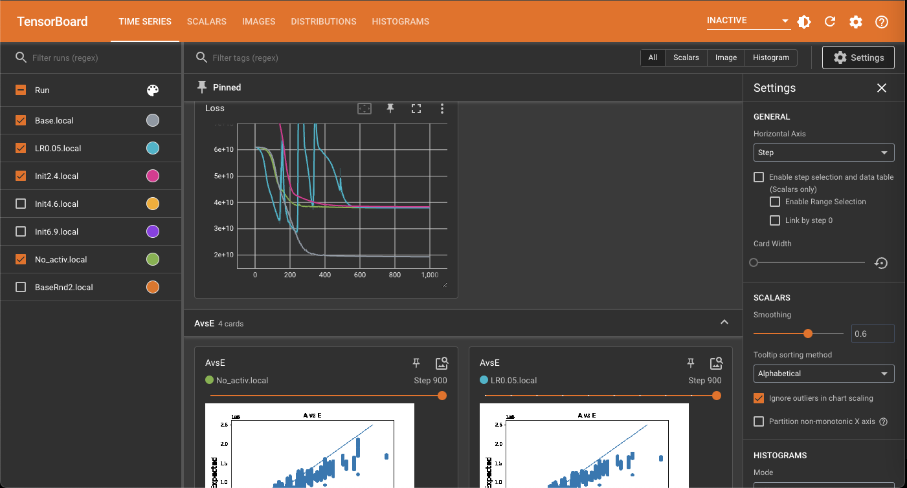

The best way learn about this is to just try it out for yourself. Use the code instructions below, get it working and have a play with different graphs – you can pick and mix from the various ones listed in the sample graph section below.

For those that are more impatient, we have also produced a Jupyter notebook that can be downloaded [here](./_DiagnosticCode.ipynb), that already has some diagnostics set up which you can run immediately to see the output without having to think about (or learn) how to set it up – you will still need to run the instructions provided in terminal though. 

The best use for Tensorboard will be when you run multiple models in order to compare them. There will be some random variation each time you run this code, so you could try running the same model a few times to see how it might work to compare different outputs. Better still, try out some of the examples in the [Hyperparameters blog](https://institute-and-faculty-of-actuaries.github.io/mlr-blog/post/research/icnn-2024-04-hyperparameters/), or try some of your own.

#### How to set up Tensorboard

First make sure tensorboard is installed (using terminal):  
`$ pip install tensorboard`

Then import SummaryWriter within your code notebook

```{python}
#| eval: false

from torch.utils.tensorboard import SummaryWriter  

```
Writer will output to the current directory that you are running the code from (ie where the notebook is saved) by default.

Once the model and code to produce the output has been run, you then can run Tensorboard by either:  

* using an instruction from terminal (ie the command line), or 
* within a Python notebook.

**For using Tensorboard via terminal:**

Run these 3 commands in terminal to change the output directory to "./runs/".  

1. $ pwd [check what current directory is]   
2. $ cd /mydirectory/Diagnostics [changes the reference to the current directory that you are running the notebook in]  
3. $ tensorboard --logdir=runs [runs Tensorboard, creating a new directory (called runs) to store the output of runs in]   

You will get a message in terminal like this one:  
Serving TensorBoard on localhost; to expose to the network, use a proxy or pass --bind_all
TensorBoard 2.11.2 at http://localhost:6006/ (Press CTRL+C to quit)

Copy the link provided (here it was http://localhost:6006/) into your browser

**For viewing Tensorboard in a Python notebook:**

Open a new notebook in the same directory as where the directory containing the output of the models you have just run is stored.
Run the following code:

```{python}
#| eval: false

%load_ext tensorboard
%tensorboard --logdir runs  

```

Tensorboard should then appear in that notebook with all the outputs that are stored in the /runs directory.

For more information on Tensorboard see [here](https://pytorch.org/tutorials/recipes/recipes/tensorboard_with_pytorch.html)

#### How to create specific graphs in Tensorboard  

First you create writer:

```{python}
#| eval: false

writer = SummaryWriter()  

```

Where you place the graphing code within the overall code depends on what type of output you get. In our example we have graphs that:  

i. plot the position at every epoch
ii. plot the position at every n epochs (in our example n = [total number of epochs] divided by 10)  
iii. plot the output at the end of the training, showing the results of the model

We provide some specific examples below.

**Scenario (i) plot the position at every epoch**

To create the [Loss](#Loss) graph to appear in Tensorboard, and for it to display the loss value for every epoch:  

* Within the [training loop](https://institute-and-faculty-of-actuaries.github.io/mlr-blog/post/research/icnn-2024-01-explainer/#trainingloop-anchor) add the following code.  

This adds a scalar plot in Tensorboard with an x value of epoch, and a y value of loss. It names the graph "Loss".

```{python}
#| eval: false

           writer.add_scalar("Loss", loss, epoch)
           
```

Or to see, say, how the learning rate changes during the fitting of the model, you could plot *current_lr* against epoch:

```{python}
#| eval: false

           writer.add_scalar('Learning Rate', current_lr, epoch)
           
```

**Scenario (ii) plot the position at every n epochs**

To create the [RMSE](#RMSE) graph to appear in Tensorboard, and for it to display the loss value periodically during training:  

* Within the [training loop](https://institute-and-faculty-of-actuaries.github.io/mlr-blog/post/research/icnn-2024-01-explainer/#trainingloop-anchor). Add the following code under the if statement that reads:
            if (epoch % self.print_loss_every_iter == 0) and (self.verbose > 0):
.  

```{python}
#| eval: false

                writer.add_scalar("RMSE", rmse, epoch)
                
```

Or to plot an [AvsE](#AvsE) graph (which here would obviously use training data only) use this code:

```{python}
#| eval: false

              fig, ax = plt.subplots()
                ax.scatter(y_tensor_batch, expected)
                ax.plot([0,2500000],[0,2500000])
                ax.set_xlabel('Actual', fontsize=15)
                ax.set_ylabel('Expected', fontsize=15)
                ax.set_title('A vs E')               
                writer.add_figure('AvsE', fig, epoch)

```

Similarly a logged version of the AvsE graph can also be produced:

```{python}
#| eval: false

                fig, ax = plt.subplots()                
                ax.scatter(ln_actual, ln_expected)
                ax.plot([0,16],[0,16])
                ax.set_xlabel('Actual', fontsize=15)
                ax.set_ylabel('Expected', fontsize=15)
                ax.set_title('A vs E Logged')               
                writer.add_figure('AvsE Logged', fig, epoch)

```

**Scenario (iii) plot the output at the end of the training**, showing the results of the model

Run this code after the model has been run.

You could run an [AvsE](#AvsE) graph like the one above, but by running it after the model has run, rather than within the training loop, you will just see the final position of the model.

First you need to create a new variable "pred_claims" to hold the predicted results.

```{python}
#| eval: false

dat["pred_claims"]=model_NN.predict(dat)

```

You could then create an [AvsE](#AvsE) graph using the whole data, or just the training or test datasets.

The code below first creates two sub datasets; one containing the training data and results, and the second the test data. It then creates an AvsE graph of the training data only in Tensorboard.

```{python}
#| eval: false

datTrain=dat.loc[dat.train_ind == 1]
datTest=dat.loc[dat.train_ind == 0]

fig, ax = plt.subplots()
ax.scatter(datTrain[youtput], datTrain["pred_claims"])
ax.plot([0,3000000],[0,3000000])
ax.set_xlabel('Actual', fontsize=15)
ax.set_ylabel('Expected', fontsize=15)
ax.set_title('Train AvsE all history')               
writer.add_figure('Train AvsE all', fig)

```

To create the [QQ plot](#QQPlot) you first need to group and sort the results into percentiles. Here we have split it into 20 groupings (ie 5th percentiles), but you could easily adapt the code to use deciles instead for example.

The following code:  

* creates a new variable *pred_claims_20cile* that sorts the predicted values into 5th percentiles (ie 20 quantiles)
* creates a new dataset *X_sum* that calculates the mean of the predicted values in each 5th percentile, in this example using the training data only
* plots a QQ plot of the mean of the actual y variate against the expected for each 5th percentile

```{python}
#| eval: false

dat["pred_claims_20cile"] = pd.qcut(dat["pred_claims"], 20, labels=False, duplicates='drop')

X_sum = dat.loc[dat.train_ind == 1].groupby("pred_claims_20cile").agg("mean").reset_index()

fig, ax = plt.subplots()
ax.scatter(X_sum.claim_size, X_sum.pred_claims)
ax.plot([0,1000000],[0,1000000])
ax.set_xlabel('Actual', fontsize=15)
ax.set_ylabel('Expected', fontsize=15)
ax.set_title(' Train QQ plot 20')               
writer.add_figure('Train QQ plot', fig)

```

### Tableau

For [Tableau](https://www.tableau.com/tableau-login-hub) use we have created a table to store the results in, which can then be imported into Tableau (or other data visualisation software such as PowerBI) to create whatever graphs you wish.

You can take a look at sample one we have created earlier [here](https://public.tableau.com/app/profile/mlr.wp/viz/Sample_Diagnostic_Blog/Result). This example is relatively limited and for illustrative purposes only, as for most investigations, and the way I have approached them, I have personally found Tensorboard more useful.

If you're wanting to share the results with other people, in particular those who wouldn't be able to access Tensorboard, then this would be very useful. It allows great flexibility and would be a good platform to put together output to 'tell a story'.

We explain here how to create tables to hold the data for importing into a Data Visualisation tool. We don't provide instructions as to how to use eg Tableau, as this information is readily avialable elsewhere.

NB: The working party only has access to the public (free) version of Tableau. This has major limitations, in particular you cannot update the data within a pre-made Viz which means you have to re-create all the graphs every time you have new data (this is not the case in the paid for version though). (For those who may be wondering why we did not use PowerBI, it is simply as it does not work on a Mac.)

#### How to produce tables to import into Tableau

We will produce a series of different tables:

1. Working, temporary tables (the dat tables):  

Table Name | Description
-----------|------------
dat | all the original data, with the position at every development period
datult | only the final position for each claim; the ultimate value
dat_qq20 | the data for the QQ plot (here using 5th percentiles)
dat_qq20ult | the data for the QQ plot, but only the ultimate position rather than for all the development periods

2. From these we will get the tables that are saved to be imported into Tableau (the Tab tables):  

* Tab = dat
* TabUlt = dat_ult
* TabQQ = dat_qq20
* TabQQUlt = dat_qq20ult

The first step is to create a new variable "pred_claims" to hold the predicted results.

```{python}
#| eval: false

dat["pred_claims"]=model_NN.predict(dat)

```

Next define some variables to describe the data and enable you to identify what model or scenario the results are from. Here are what we have set up, of course you can vary these as you wish.

```{python}
#| eval: false

dat["ID"]=ID
dat["Who"]=who
dat["Scenario_date"]=now
dat["Scenario1"]=S1
dat["Scenario2"]=S2
dat["Scenario3"]=S3
dat["Data1"]=D1

```

To create the *datult* table:

```{python}
#| eval: false

dat["pred_claims"]=model_NN.predict(dat)

```

To produce the tables for the QQ plots:

```{python}
#| eval: false

dat["pred_claims_20cile"] = pd.qcut(dat["pred_claims"], 20, labels=False, duplicates='drop')

dat_qq20 = dat.groupby("pred_claims_20cile").agg("mean").reset_index()
dat_qq20ult = dat_ult.groupby("pred_claims_20cile").agg("mean").reset_index()

```

You can split the data by train or test dataset using the flag 'train' in the data. If it is set to 1 then it is the training data, if it is set to 0 then is it the test data. You could also use this flag within Tableau.

To produce the [occurence and development period graphs](#DevPeriod):

```{python}
#| eval: false

dat_all_occ = dat.assign(payment_size_pred = model_NN.predict(dat)).groupby(["occurrence_period"]).agg({youtput: "mean", "payment_size_pred": "mean"})
dat_train_occ = dat.assign(payment_size_pred = model_NN.predict(dat)).loc[lambda df: df.train_ind].groupby(["occurrence_period"]).agg({youtput: "mean", "payment_size_pred": "mean"})
dat_test_occ = dat.assign(payment_size_pred = model_NN.predict(dat)).loc[lambda df: ~df.train_ind].groupby(["occurrence_period"]).agg({youtput: "mean", "payment_size_pred": "mean"})
dat_all_dev = dat.assign(payment_size_pred = model_NN.predict(dat)).groupby(["development_period"]).agg({youtput: "mean", "payment_size_pred": "mean"})
dat_train_dev = dat.assign(payment_size_pred = model_NN.predict(dat)).loc[lambda df: df.train_ind].groupby(["development_period"]).agg({youtput: "mean", "payment_size_pred": "mean"})
dat_test_dev = dat.assign(payment_size_pred = model_NN.predict(dat)).loc[lambda df: ~df.train_ind].groupby(["development_period"]).agg({youtput: "mean", "payment_size_pred": "mean"})

```

**Create the datasets to be saved**

For the first model you run, you are creating new tables. For subsequent model runs you will want to append the temporary dat tables to the previously saved Tab tables.

So for the first run, create new tables and then save them:

```{python}
#| eval: false

Tab = dat
TabUlt = dat_ult
TabQQ = dat_qq20
TabQQUlt = dat_qq20ult

Tab.to_csv("/mydirectory/Tab.csv", index=False)
TabUlt.to_csv("/mydirectory/TabUlt.csv", index=False)
TabQQ.to_csv("/mydirectory/TabQQ.csv", index=False)
TabQQUlt.to_csv("/mydirectory/TabQQUlt.csv", index=False)

```

For subsequent models that you run you want to append the temporary tables to the saved tables (that are to be imported into Tableau).  
To do this, tirst read in the previously saved Tab tables.  
Then append the dat dataset to it.

```{python}
#| eval: false

Tab = pd.read_csv("/mydirectory/Tab.csv")
TabUlt = pd.read_csv("/mydirectory/TabUlt.csv")
TabQQ = pd.read_csv("/mydirectory/TabQQ.csv")
TabQQUlt = pd.read_csv("/mydirectory/TabQQUlt.csv")

Tab = Tab.append(dat, ignore_index=True)
TabUlt = TabUlt.append(dat_ult, ignore_index=True)
TabQQ = TabQQ.append(dat_qq20, ignore_index=True)
TabQQUlt = TabQQUlt.append(dat_qq20ult, ignore_index=True)

```

Finally, save the latest Tab tables.

```{python}
#| eval: false

Tab.to_csv("/mydirectory/Tab.csv", index=False)
TabUlt.to_csv("/mydirectory/TabUlt.csv", index=False)
TabQQ.to_csv("/mydirectory/TabQQ.csv", index=False)
TabQQUlt.to_csv("/mydirectory/TabQQUlt.csv", index=False)

```

Another approach could be to save the *dat* file for every model you run (after you have added the *pred_claims* variable to store the predicted result)s, so long as you appropriately name each individual output so you can identify them later. You could then take whichever tables you want to use at later data, process them as appropriate depending on which graphs you want, and then combine them together in a table to import into Tableau.

### Pyplot

These are arguably the simplest to produce, but are only shown in your notebook for the particular run of code that you have just done, so it is not possible to compare different model runs easily. You can however cut and paste these graphs, or save them as a file, for example to use in a Powerpoint presentation.

You will need to have imported pyplot from matplotlib:

```{python}
#| eval: false

from matplotlib import pyplot as plt

```

First create a new variable *pred_claims* to hold the predicted results.

```{python}
#| eval: false

dat["pred_claims"]=model_NN.predict(dat)

```

The process (and code) is very similar as for each of the Scenario (iii) Tensorboard examples already described above, so we just show the [AvsE](#AvsE) graph example here.

```{python}
#| eval: false

plt.scatter(datTrain["claim_size"], datTrain["pred_claims"])
plt.xlabel('Actual')
plt.ylabel('Expected')
plt.plot([0,2500000],[0,2500000])

```

More complicated is the [plots by occurrence and development period](#DevPeriod):

```{python}
#| eval: false

#You could plot mean or sum, here mean is used

def make_model_subplots(model, dat):
    fig, axes = plt.subplots(3, 2, sharex='all', sharey='all', figsize=(15, 15))

    (dat
        .assign(payment_size_pred = model.predict(dat))
        .loc[lambda df: df.train_ind]
        .groupby(["occurrence_period"])
        .agg({youtput: "mean", "payment_size_pred": "mean"})
    ).plot(ax=axes[0,0], logy=True)
    axes[0,0].title.set_text("Train, Occur")

    (dat
        .assign(payment_size_pred = model.predict(dat))
        .loc[lambda df: df.train_ind]
        .groupby(["development_period"])
        .agg({youtput: "mean", "payment_size_pred": "mean"})
    ).plot(ax=axes[0,1], logy=True)
    axes[0,1].title.set_text("Train, Dev")

    (dat
        .assign(payment_size_pred = model.predict(dat))
        .loc[lambda df: ~df.train_ind]
        .groupby(["occurrence_period"])
        .agg({youtput: "mean", "payment_size_pred": "mean"})
    ).plot(ax=axes[1,0], logy=True)
    axes[1,0].title.set_text("Test, Occ")

    (dat
        .assign(payment_size_pred = model.predict(dat))
        .loc[lambda df: ~df.train_ind]
        .groupby(["development_period"])
        .agg({youtput: "mean", "payment_size_pred": "mean"})
    ).plot(ax=axes[1,1], logy=True)
    axes[1,1].title.set_text("Test, Dev")

    (dat
        .assign(payment_size_pred = model.predict(dat))
        .groupby(["occurrence_period"])
        .agg({youtput: "mean", "payment_size_pred": "mean"})
    ).plot(ax=axes[2,0], logy=True)
    axes[2,0].title.set_text("All, Occ")

    (dat
        .assign(payment_size_pred = model.predict(dat))
        .groupby(["development_period"])
        .agg({youtput: "mean", "payment_size_pred": "mean"})
    ).plot(ax=axes[2,1], logy=True)
    axes[2,1].title.set_text("All, Dev")
    
make_model_subplots(model_NN, dat)

```

## Sample specific graphs and diagnostics {#section2}

#### RMSE {#RMSE}
This plots the measure of the loss or error term as the model is fitting. Epochs are shown on the x axis, and the size of the RMSE on the x axis. You can see how the error term is reducing as the model is being fitted  
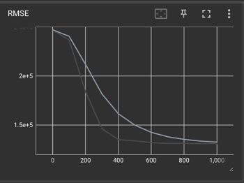

#### Loss {#Loss}
This is similar to the RMSE graph, but allows you to plot an alternative loss or error term instead. In this example  the PyTorch MSELoss function is plotted.  
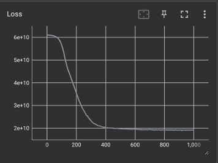

#### AvsE {#AvsE}
Actual y value against Expected, ie the model’s predicted value

We have various subsets of this graph:  

* **All** records in the model are shown, ie there will be many points for each claim at each development period  
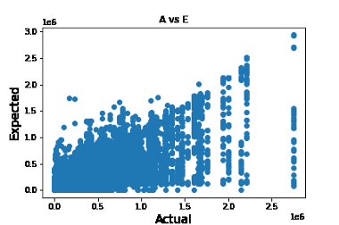
* **Ultimate** or (Ult) – where only one point is shown for each record  
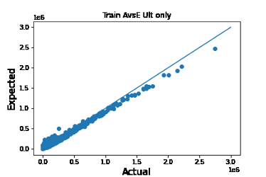

For each of these there may be subsets:  

* **Train** – just those in the training dataset
* **Test** – just those in the test dataset
* **All** – both training and test datasets combined

**Logged values** – useful as the distribution tends to be skew [example graph] with many more smaller values than larger ones, and it will let you see what is happening with the smaller values more easily.
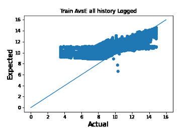

This graph shows logged values, but just for those from the train dataset and the ultimate values (ie one value for each claim) only:  
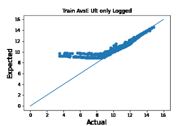
 

You can also plot graphs at different stages of the fitting process.  
Here is the AvsE graph after 100 epochs:  
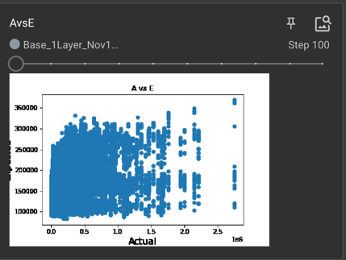
 

And here after 300 epochs:  
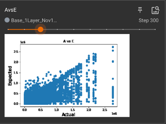  
In our example you can look at the development of the AvsE graph in Tensorboard dynamically at each 100th epoch.
 

#### QQ plot {#QQPlot}
A qq or quantile-quantile plot is a measure of the goodness of fit of a model. It orders the actual y values into (in this example) 5% quantiles. It then does the same for the expected, or predicted, values from the model and plots them on a graph. The closer the points are to the straight line the better the fit is. Here there are 20 points plotted as the data was split into 5% bands.  
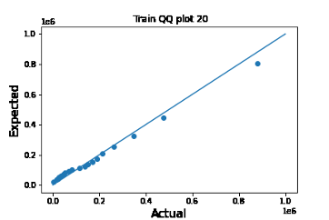
 
Various subsets of this graph may be produced:  

* Train – just those in the training dataset
* Test – just those in the test dataset
* All – both training and test datasets combined

#### Graphs by occurrence period and development period {#DevPeriod}

Each row of graphs shows a different dataset; train, test and all (or both combined)

The left hand column of graphs shows a plot of the total actual and expected y variates (here the ultimate claim  size) against occurence period. The blue line is actual values and the orange line expected.

The right hand column of graphs is the same but shows the plot against development period (rather than occurrence period).  
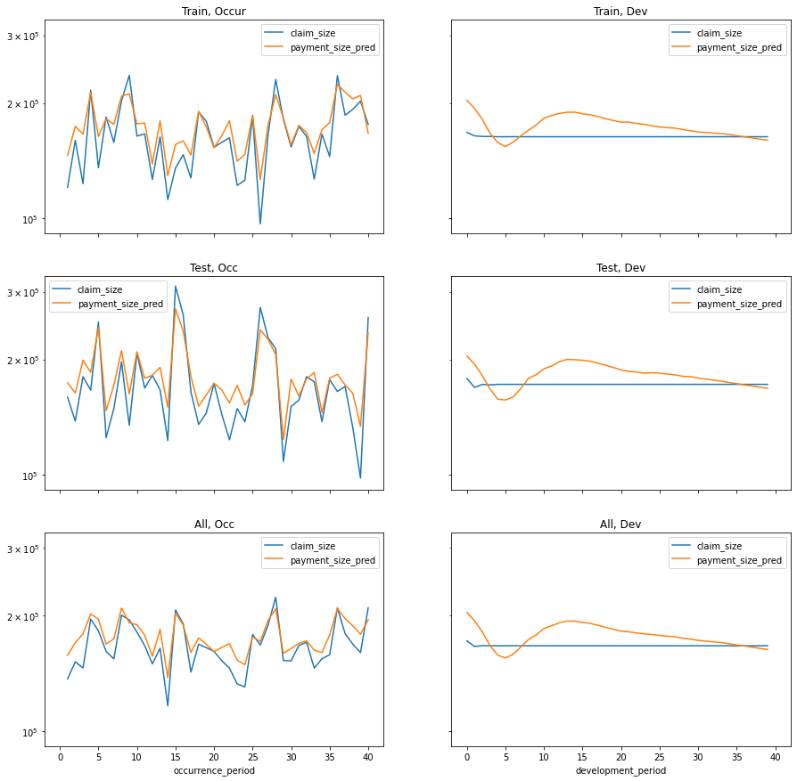
