# Neural Network Hyperparameters

*This [article](https://institute-and-faculty-of-actuaries.github.io/mlr-blog/post/research/icnn-2024-04-hyperparameters/) was written by Sarah MacDonnell and originally published on 20 October 2025.*


## Introduction  

This is the third blog in our [Practical Introduction to Neural Network Blog Series](https://institute-and-faculty-of-actuaries.github.io/mlr-blog/post/research/icnn-2024-02-covering/).

Hyperparameters are a set of levers that you can pull to optimise a neural network.

This provides a basic introduction to how some of the main hyperparameters work. It is designed for someone new to using neural networks in order to give them a practical introduction to some of the main hyperparameters, and to give them confidence to explore the impact of each of them for themselves. We provide sample code in this blog to show how to alter specifc hyperparameters on our sample neural network.

Details of the sample neural network are provided in the [Explainer blog](https://institute-and-faculty-of-actuaries.github.io/mlr-blog/post/research/icnn-2024-01-explainer/) which sets up and runs a simple neural network on individual claims data. It is assumed that you have been through and have run the accompanying code before reading this document. 

This has been written assuming that the reader will dip in and experiment with different scenarios themselves, rather than simply reading through this document in order.

**Beware**: What we can learn from models using the [SPLICE data](https://institute-and-faculty-of-actuaries.github.io/mlr-blog/post/research/icnn-2024-01-explainer/#section2) will be limited as it is relatively simple and does not have many explanatory variables. It is not possible to generalise the findings made here to other models or other datasets.

This is one reason why we encourage you to experiment yourself on real datasets.

Also beware of random variation; each time you run the same model you do not necessarily get the same answer. Take this into account before drawing any conclusions (see section 1.iii. below).

We intend to add further insights over time to provide a central resource and if you come across any interesting findings or have ideas for how this blog can be improved please get in touch with us.  

## How to use this document

The intention is for the reader to try out different hyperparameters for themselves. This material is intended to make running that code more accessible and gives you ideas of what to try. 

We look at various hyperparameters one by one. Each section is further divided into subsections:  

* Description of what the hyperparameter does 
* High level findings  
* Workings/code - details of how to alter the hyperparameters yourself  
* Detailed findings  

This is not an exhaustive investigation. Please take the conclusions as illustrative only – on different data and in different circumstances other conclusions may be drawn.

The graphs used in this blog are taken from Tensorboard output. The labelling on them is not always very clear and some will be hard to read for those who are colour blind. The aim behind this blog is for the reader to experiment themselves, so we would encourage you to run the output for yourself in Tensorboard if you want a closer look at any of the graphs. A full description of each of the graphs can be found in our accompanying [diagnostics blog](https://institute-and-faculty-of-actuaries.github.io/mlr-blog/post/research/icnn-2024-03-diagnostics/#section2).

**Contents**  

We start with a section highlighting the **Overall Findings**, and then go into more detail for each of the hyperparameters section by section:  

1.	Optimiser, learning rate and random variation
2.	Layers, nodes and dropout  
3.	Activation function
4.	Initialisation   
5.	Loss function/Error term  
6. Batch norm

## Overall Findings

This document is designed to give those new to using neural networks confidence in using and applying hyperparameters. *The findings here are just what we found with this particular model, on this dataset, with the specific parameters that we tested. These findings are in no way a definitive summary of what hyperparameters to apply when.* We encourage readers to experiment themselves on their own data.

We found ***specifically for our sample model*** that:  

*	Initialisation is very important  
* The learning rate is one of the most useful and significant parameters to help the fitting process  
*	AdamW is a good optimiser  
* Batch norm can help the fitting process (but did not make much difference to our results in this instance) 
* Additional nodes generally improved the fit
* Different error terms will give different outcomes, though in our tests we did not find any that worked better than the MSE (mean square error)  
* The outputs from our test and train results were consistently very similar. This was not surprising given the simple nature, and the stable development pattern of the dataset we were using.  

**Cautions**:  

*	Beware of random variation – each time you run the same model you do not necessarily get the same answer. Take this into account before drawing any conclusions.  
*	The SPLICE dataset as we have used it here is relatively simple. Due to the limited number of parameters overfitting is not likely to be a particular problem, hence in these investigations the benefits of hyperparameters such as regularisation, dropout or the impact of additional layers and nodes are not likely to be picked up.  
* Using a different dataset and/or different model you are likely to find different results than we have found here, hence do not rely on these findings. This blog is intended to help the reader learn to test the effectiveness of different hyperparameters for themselves.

## Optimiser, learning rate and random variation

An optimiser updates the model's parameters (weights and biases) to minimise the loss function during the training process. One of the most basic optimisers that many actuaries will already be familiar with is gradient descent. An introduction to optimisers can be found [here](https://towardsdatascience.com/neural-network-optimizers-made-simple-core-algorithms-and-why-they-are-needed-7fd072cd2788).

We have used the AdamW optimiser in our example. AdamW is an optimisation algorithm that has built on useful features found from other optimisers such as momentum, an adaptive learning rate and bias correction. AdamW differs from the original Adam optimiser by using weight decay regularisation.

Here is a link to a paper that provides a comprehensive explanation of the different optimisers that are available. For much of machine learning a lot of good material already exists and we do not seek to repeat it here, but we do signpost you to it. To get the most out of this section we highly recommend reading [this paper](https://arxiv.org/pdf/1609.04747.pdf) to understand differences between optimisers, and why each can improve the fitting process of the model.

In this section we investigate:  
i.	SGD (stochastic gradient descent) against AdamW  
ii.	Impact of changing the learning rate  
iii.	Random variation  
iv.	Impact of using OneCycleLR (a scheduler that adjusts the learning rate during the training process)  
v.	Regularisation and the impact of changing weight decay  

#### Findings  
*	Not unexpectedly the AdamW optimiser was far superior to SGD in that it fits much more quickly and efficiently.  
*	It is important to find the learning rate that works best for your model. Too high and the model can be unstable, or it can take too big a step and may miss a better solution. Too small and the model can take a long time to fit.  
*	Beware of random variation – each time you run the same model you do not necessarily get the same answer. Take this into account before drawing any conclusions.  
*	In this example we didn’t find that OneCycleLR was necessarily providing a significant improvement (depending upon what learning rate was being used), however on a more complex dataset with more variables it is likely to prove a useful addition.  
*	For this dataset the weight decay did not seem to have a big impact. It may be the case that as the dataset is relatively simple and does not have many explanatory variables, the chance of the model overfitting is likely to be reduced, and hence there is little need for weight decay.  

#### i.	SGD compared to AdamW

The optimiser is defined in the [partial fit method](https://institute-and-faculty-of-actuaries.github.io/mlr-blog/post/research/icnn-2024-01-explainer/#partialfit-anchor) of the TabularNetRegressor class:

```{python}
#| eval: false

        optimizer = torch.optim.AdamW(
            params=self.module_.parameters(),
            lr=self.max_lr / 10,
            weight_decay=self.weight_decay
        )
        
        # Scheduler - one cycle LR
        scheduler = torch.optim.lr_scheduler.OneCycleLR(
            optimizer, 
            max_lr=self.max_lr, 
            steps_per_epoch=1, 
            epochs=self.max_iter
        )  

```

To apply SGD instead of AdamW, you just adjust the code as shown below.

```{python}
#| eval: false

        optimizer = torch.optim.SGD(
            params=self.module_.parameters(),
            lr=self.max_lr / 10,
            weight_decay=self.weight_decay
        )

```

When we initially changed to SGD from AdamW the model would not fit. It was only by drastically reducing the learning rate, from 0.01 to 10e-12 that we managed to get it to fit. Please refer to section ii. below to see how to change the learning rate.

The graph of the loss by epoch is shown below. The loss function used here was MSE – please refer to the [explainer blog](https://institute-and-faculty-of-actuaries.github.io/mlr-blog/post/research/icnn-2024-01-explainer/#glossary1) for more details. An epoch is an individual training run.  

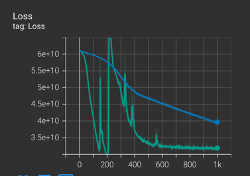

The green line is AdamW and the blue line SGD. We can see the model using AdamW fits much quicker than SGD as you would expect (especially given the much smaller learning rate needed for SGD). However, it does not look very stable – the green line fluctuates a lot before settling down again.

The following graph shows what would happen if we increased the number of epochs 10 times from 1,000 to 10,000 for the SGD. There are 2 lines on the graph; the smooth blue line that is also in the graph above and which stops at 1,000 epochs, and the lighter blue line which is the same model set up to run for 10,000 epochs. It can be seen that the SGD does actually get to a very similar point to where the AdamW optimiser does, but it takes much longer.

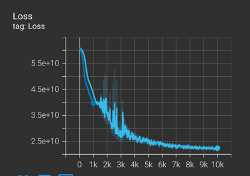

This model is run on a small dataset, so the time taken to fit the model is not an issue here. However for most models efficiency is likely to be an issue – we can clearly see here the advantage that AdamW brings.

#### ii.	Impact of changing the learning rate

What happens if you adjust the learning rate?

The learning rate is one of the most important hyperparameters to tune in a NN (Neural Network). It controls how much we adjust the weights with respect to the loss gradient, i.e. how big a step the model should take between each iteration.

To change the learning rate you simply update the max_lr parameter which is set at the beginning of the [TabularNetRegressor class](https://institute-and-faculty-of-actuaries.github.io/mlr-blog/post/research/icnn-2024-01-explainer/#tabularnetregressor-anchor):

```{python}
#| eval: false

        max_lr=0.01,

```

The graph of loss by epoch below shows a learning rate of 0.05 (green line) against a learning rate of 0.01 (grey line). 


The graph shows that the learning rate of 0.01 is more stable and results in a ‘better’ solution (i.e. a lower loss or smaller error term between actual and predicted values). Using a learning rate of 0.05, we found that on occasion the model did not converge.
 
We can also look at how a slightly larger learning rate of 0.02 would fare (shown by the additional blue line in the graph below).  We can see that it produces a very similar result to using 0.01, but it is a bit less stable.

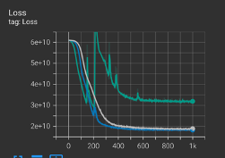
 
Following this finding we have adjusted our model to using a learning rate of 0.01 going forward.

#### iii.	Random variation  
It is important to remember that there is a random element to how each model fits – you won’t get the exact same results each time you run the same model.

However, as we have seen, with a lower learning rate for example, the process of fitting the model is more stable, and the difference due to random variation between each model will be less.

Here the exact same model, our base model, with a learning rate of 0.01, is run 5 different times. The loss can be seen to vary each time, however the differences are not too great.

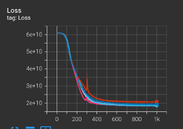

If we also compare the AvsE output for two of these models, we see again that the difference is not too great here. The left graph below corresponds to the higher red loss line above, and the right graph to the (slightly hidden behind the blue line) grey line.
   
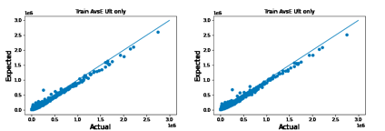

If we do the same thing with a higher learning rate of 0.05, we can see that the loss varies much more significantly each time the same model is run. In fact we can see in this example that one of the runs did not converge (the purple line).

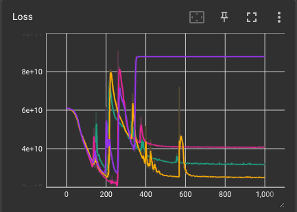

This shows how random variation can be an issue, it is something one needs to take into consideration when determining the optimum model. A question to ask is do you always see this feature with this particular model, or could the results that you are seeing be a random fluke that won’t be repeated very often?

It is possible to get rid of the random variation and to reproduce the same results, by seeding the random generator. This can be useful when comparing different scenarios and also to allow independent researchers to reproduce results. You would do this in our example by manually setting the seed of the PyTorch random number generator using the following code:

```{python}
#| eval: false

import torch
torch.manual_seed(3)

```

We experimented applying this to the above example, and we did get the same output each time we reran the model, without any of the random variation. (NB: this may not be the case with all types of neural networks such as LSTMs, so do try this out for yourself). 

However, understanding how a particular model varies due to random variation is an important part of the tuning process, as well as in understanding which model works best when, and in gaining insights into how it is working.

#### iv.	Investigate using OneCycleLR

In the above examples we have used a scheduler called OneCyleLR. A scheduler adjusts the learning rate during the training process, they are designed to train models faster and have better final performance through optimising the learning rate.  

The key features of the OneCycleLR scheduler are:  

1.	Cyclical Learning Rates: It varies the learning rate in a cyclical manner rather than keeping it constant or monotonically decreasing. The learning rate starts from a lower bound, increases to a maximum value, and then decreases again to a lower value.  

2.	Phases:
*	First Phase: The learning rate initially increases linearly or exponentially from a minimum value to a maximum value. Using smaller steps at the beginning reduces the chance that the gradients explode. This phase helps the model to converge rapidly to a good solution.  
*	Second Phase: After reaching the maximum, the learning rate then decreases, usually following a similar but reversed trajectory, back to a minimum value. Smaller steps at this point in the process let you fine tune to a lower loss, hence this phase refines the solution, helping the model to converge to a better minimum.  

3.	Benefits:  
*	Faster Convergence: By using higher learning rates for part of the training, the model can explore the loss landscape more effectively, potentially leading to faster convergence.
*	Regularisation Effect: The cyclical nature of the learning rate acts as a form of regularisation, helping to avoid overfitting and improving the model's generalisation.  

In practice, using OneCycleLR requires tuning specific parameters like the maximum and minimum learning rates and the length of the cycle, which can depend on the specific dataset and model architecture.  

The input parameters for [OneCycleLR](https://pytorch.org/docs/stable/generated/torch.optim.lr_scheduler.OneCycleLR.html) in our code are max_lr and weight_decay only.  

* max_lr is used to define the maximum learning rate.

* weight_decay adds a penalty term to the loss function, which helps to prevent overfitting by penalising large weights in the model.  

**What difference does it make if we don’t use OneCycleLR?**  

We used the AdamW optimiser and compared the results with and without OneCylceLR. We also tried changing the maximum learning rate input, max_lr (see section ii above to see how to change the learning rate).

The optimiser and the scheduler are defined in the [partial_fit](https://institute-and-faculty-of-actuaries.github.io/mlr-blog/post/research/icnn-2024-01-explainer/#partialfit-anchor) method of the [TabularNetRegressor class](https://institute-and-faculty-of-actuaries.github.io/mlr-blog/post/research/icnn-2024-01-explainer/#tabularnetregressor-anchor).

```{python}
#| eval: false

# Optimizer
        optimizer = torch.optim.AdamW(
            params=self.module_.parameters(),
            lr=self.max_lr / 10,
            weight_decay=self.weight_decay
        )
        
# Scheduler - one cycle LR
        scheduler = torch.optim.lr_scheduler.OneCycleLR(
            optimizer, 
            max_lr=self.max_lr, 
            steps_per_epoch=1, 
            epochs=self.max_iter
        )

```

If we rerun the model without OneCycleLR (the orange line on the graph below is without OneCycle LR, the blue line is with), we see that the model is much slower to run – it needs to run through more epochs. Here it looks like OneCycleLR is making a significant improvement to the fitting of the model.

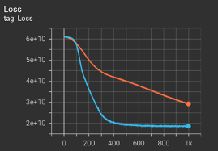
 
However, if we adjust the learning rate for the model without OneCycleLR, a higher learning rate seems to work well. This graph is a repeat of the one above, where a learning rate of 0.01 was used, with two extra lines added. The darker blue line is without OneCycleLR and a learning rate of 0.05, the grey line is without OneCycleLR and a learning rate of 0.1.

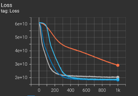

If you compare the light blue line of the model using OneCycleLR, against the grey and dark blue lines of models which are not using OneCycleLR in the graph above, you can see how the model with OneCycleLR initially (i.e. for the first ~100 epochs) takes longer to find a solution but then catches up quickly (this is consistent with the theory that OneCycleLR has a smaller learning rate at the beginning which it then increases).

These are the corresponding AvsE graphs for learning rates of 0.01 and then 0.05 and 0.1 (orange, darker blue and grey lines on the above graph respectively).
  
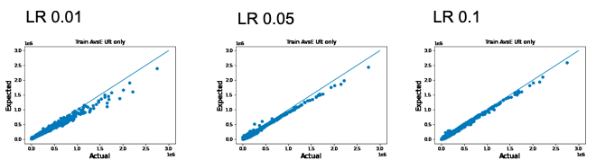

However, as we increase the learning rate further, without OneCycleLR, to 0.2 or 0.5 then the model becomes less stable (the blue line is 0.2, the red line is 0.5):

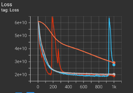
 
The AvsE graphs for learning rates without OncCycleLR of 0.2 and 0.5 respectively are shown below:
  
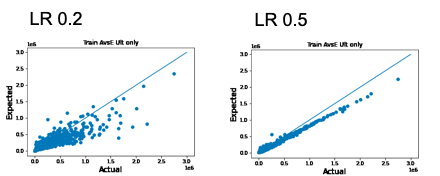

We found that OneCycleLR at higher learning rates was actually worse than without OneCycleLR. In the following graph the green line is using OneCycleLR with a learning of 0.05. The pink and orange lines are without OneCycleLR and with learning rates of 0.05 and 0.1 respectively.

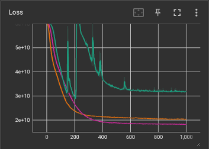

So to summarise, a learning rate of 0.01 performed better with OneCycleLR than without, in terms of a significant increase in the speed of the model fitting. However when using a higher learning rate of 0.05 the model was better when *not* using OneCycleLR. The graph below shows the development of the loss function with OneCycleLR; the green line with a learning rate of 0.05, and the grey line a learning rate of 0.01, compared against the pink line which does **not** use OneCycleLR and has a learning rate of 0.05.

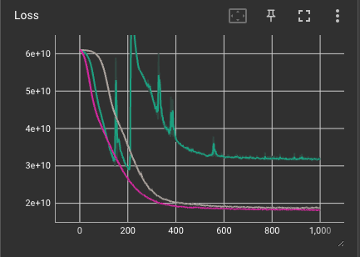  

There are more investigations that could be done, such as investigating momentum tuning, or changing the minimum learning rate or the length of the cycle. This is intended to be an introduction to hyperparameters so we have not gone into that level of detail here.

#### v.	Regularisation and the impact of changing weight decay

Regularisation is a technique used in machine learning to prevent overfitting and encourage simpler models, by adding a penalty term to the loss function, specifically penalising large weights by adding the absolute values of the weights to the loss. 

Our code is set up to use Lasso or L1 regularisation, but we do not use it in our example in practice (as the L1_penalty parameter is set to 0).  

Weight decay is a form of L2 or Ridge regularisation. It specifically refers to the practice of shrinking the weights towards zero by subtracting a portion of the weights themselves from the weights during the update step. 

Here we have just focussed on weight decay, however you may also want to do similar analyses on the other types of regularisation too.

NB: In AdamW, weight decay is decoupled from the gradient-based update, which can lead to different behaviour than traditional L2 regularisation, especially when learning weights are adaptive. (For a reminder of the process of updating gradients you may want to revisit the [theory behind neural networks](https://mlu-explain.github.io/neural-networks/). A comprehensive description of the different types of optimisation algorithms, including gradient descent, is given in [this paper](https://arxiv.org/pdf/1609.04747.pdf)).

To change the weight decay you simply update the weight_decay parameter which is set at the beginning of the [TabularNetRegressor class](https://institute-and-faculty-of-actuaries.github.io/mlr-blog/post/research/icnn-2024-01-explainer/#tabularnetregressor-anchor).

```{python}
#| eval: false

        weight_decay=0.0,

```

We didn’t see that weight decay had a great impact here so we didn’t investigate further. This wasn’t surprising as overfitting is unlikely to be a problem with this model as the dataset is relatively simple with not too many explanatory variables.

The graph below shows the orange line in the centre which has no weight decay, green is with a weight decay of 0.01, and grey is using a weight decay of 0.1 (it is possible that random variation could be distorting the results here).

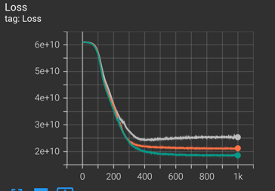

## Layers, Nodes and Dropout

We can have any number of hidden layers and nodes (also known as neurons) that we choose in a neural network. Here we look at what happens to our sample neural network model when we change these.  

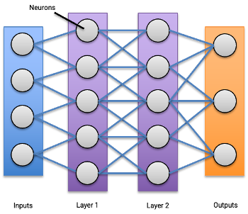

We also look at the impact of dropout, i.e. what happens if the model is pruned with random nodes taken out.

The SPLICE data is quite simple with relatively few parameters, so we would expect the impact of increasing nodes and layers to be limited for this dataset.

#### Findings
*	In general adding more nodes seems to give a better fit, particularly with respect to larger claims. The pay off is that with additional nodes (and layers) the model takes longer to run.  
*	The number of layers doesn’t seem to make a great deal of difference, though there is a slight suggestion that an extra layer may help the smaller claims to fit slightly better.  
*	Dropout performs worse at larger sizes and seems to affect the large claims most. This would make sense as the more nodes that droput you would be likely to get findings that mirror the situation you found with a model with fewer nodes.

NB: We might expect to get different and more significant results with a more complex dataset.


**Other observations**  

* A higher number of nodes seemed to lead to more stable outcomes eventually, i.e. a lower number of nodes were more likely to lead to a greater spread of different random outcomes.  (At the same time, there was a slight indication that a higher number of nodes could lead to more ‘wobbles' being seen in the loss value as the model fitted, but these did all still tend to converge).    
* The test and train outputs were all remarkably consistent.  
* It is possible to look at how the weights, biases and gradients change as a model fits, this might be something that warrants further investigation.  

#### i.	Impact of changing the number of nodes and layers

To change the number of nodes you simply update the n_hidden parameter which is set at the beginning of the [TabularNetRegressor class](https://institute-and-faculty-of-actuaries.github.io/mlr-blog/post/research/icnn-2024-01-explainer/#tabularnetregressor-anchor). Our model has been set up so that the same number of nodes is always used for each layer; the parameter n_hidden is used for every hidden layer. You could vary this by creating different parameters for the numbers of nodes in each layer instead.

```{python}
#| eval: false

        n_hidden=5,                  
        
```

Changing the number of layers is a little less straightforward. This can be done in the section of code that [defines the neural network model](https://institute-and-faculty-of-actuaries.github.io/mlr-blog/post/research/icnn-2024-01-explainer/#step2). The first sample of code below shows the code needed to model 1 layer, and the second shows the code needed to model 2 layers.

```{python}
#| eval: false

# 1 Layer
        self.hidden = torch.nn.Linear(n_input, n_hidden)   # First hidden layer
    
        h = F.relu(self.hidden(x))
        if self.batch_norm:
            h = self.batchn1(h)
        h = self.dropout(h)

        return torch.exp(self.linear(h))                                     
        
```

```{python}
#| eval: false

# 2 Layers
        self.hidden = torch.nn.Linear(n_input, n_hidden)   # First hidden layer
        self.hidden2 = torch.nn.Linear(n_hidden, n_hidden)  # Second hidden layer

        
        h = F.relu(self.hidden(x))
        if self.batch_norm:
            h = self.batchn1(h)
        h = self.dropout(h)

        # Second hidden layer
        h2 = F.relu(self.hidden2(h))
        if self.batch_norm:
            h2 = self.batchn2(h2)
        h2 = self.dropout(h2)

        return torch.exp(self.linear(h2))                                    
        
```

As you increase the number of nodes, it can be seen that the fit for the larger claims improves. Adding additional layers appears to have less of an impact.

For example, these are **AvsE graphs** for the ultimate position at the last development period only. From these graphs it doesn't appear that adding an additional layer makes much of a difference.
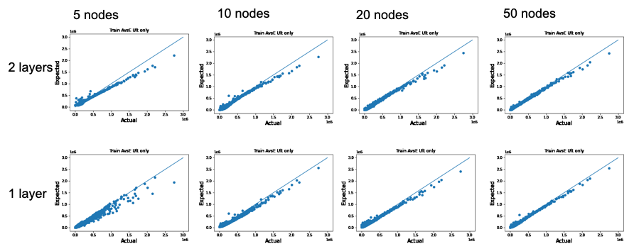

  
When we look at the logged version of these graphs, there is some suggestion that that the extra layer might help to improve the fit for smaller claims where there are a larger number of nodes.
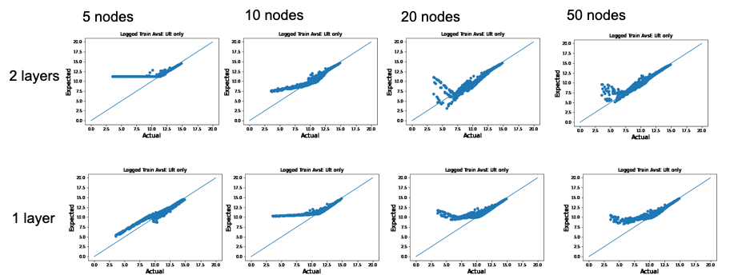


We can also see something similar if we look at the **QQ plots**.  
A qq or quantile-quantile plot is a measure of the goodness of fit of a model. It orders the actual y values into (in this example) 5% quantiles. It then does the same for the expected, or predicted, values from the model and plots them on a graph. The closer the points are to the straight line the better the fit is.
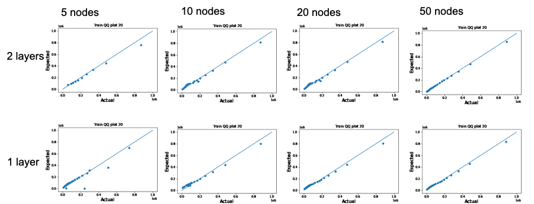

These observations are also mirrored in the loss graphs (epochs are shown on the x axis, and the loss term of MSE on the y axis). These show that the higher the number of nodes the smaller the loss - in both graphs the height of the lines directly corresponds to the number of nodes. The first graph shows models with 2 layers, and the second those with 1 layer. There seems to be a slight improvement (i.e. a lower loss measurement) with 2 layers rather than 1.  

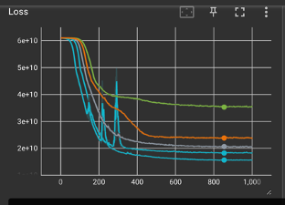 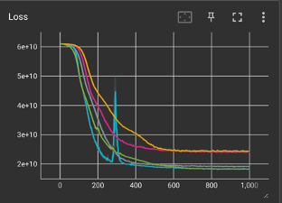 

#### ii. Dropout rate

Dropout is a regularisation technique used in neural networks to prevent overfitting. 

During training, the process of dropout works by randomly "dropping out" (i.e. by setting to zero) a proportion of the neurons in a layer. This deactivation happens independently for each neuron and each batch of data. The dropout rate determines the probability of a neuron being dropped. For example, a dropout rate of 0.5 means each neuron has a 50% chance of being deactivated during each training step.

By randomly dropping neurons, the network is forced to learn more robust features. Since it cannot rely on the presence of particular neurons, the network must learn redundant representations to ensure that the relevant information is captured even when some neurons are missing. 

During training, different "versions" of the network are learned, as different sets of neurons are dropped in each training step. This can be thought of as training an ensemble of networks, which helps in generalising better. 

Considerations:  

* Dropout reduces the model's ability to memorise or overfit to the training data, encouraging it to learn more general patterns.  
* As dropout introduces noise into the training process, more epochs may be required for the network to converge.  
* Dropout is often used alongside other regularisation techniques like L1/L2 regularisation and batch normalisation.

As the SPLICE dataset is relatively simple you would not expect it to suffer from overfitting, hence we would not expect dropout to have as much of an impact as it would for datasets with, for example, more explanatory variables.

To change the dropout rate you simply update the dropout parameter which is set at the beginning of the [TabularNetRegressor class](https://institute-and-faculty-of-actuaries.github.io/mlr-blog/post/research/icnn-2024-01-explainer/#tabularnetregressor-anchor). A value of 0.5 means that each node has a 50% chance of randomly dropping out, 0.01 a 1% chance.
  
```{python}
#| eval: false

        dropout=0.01,                                   
        
```

This graph shows the plot of loss value against number of epochs on the x axis:  
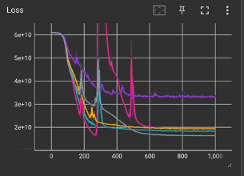

Generally, a larger dropout rate seems to provide a worse fit. The final loss value for each of the models can be seen to increase for each of the respective dropout rates, 0.01, 0.05, 0.1 through to 0.5.  
The pink wobbly line on the graph represents no dropout being used - it seems to produce a more unstable, volatile fit, but it ended up with a reasonably low loss value.

If we look at the AvsE graph for the ultimate values, we can see that it is with the large claims that the fit seems to be changing most as the dropout rate increases.
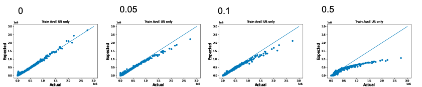

This is perhaps not surprising as it mirrors our previous finding that the fewer nodes there are the worse the fit. It should be noted that this is a simple dataset without many explanatory variables and so we were not expecting to find that more nodes or layers would necessarily increase the fit. It is likely that the results could be more significant with a different model.

NB: When applying the model to test data, dropout is not used. All neurons are active. To compensate for the higher number of active neurons (as compared to training), the outputs of neurons are typically scaled down by the dropout rate. For instance, if the dropout rate is 0.5, the outputs are halved. This ensures that the total contribution of the neurons remains consistent between training and inference.  

In our models the test and train results were very similar. This is not necessarily surprising as the development data we were using is very stable and so there should be little difference between the train and test datasets.

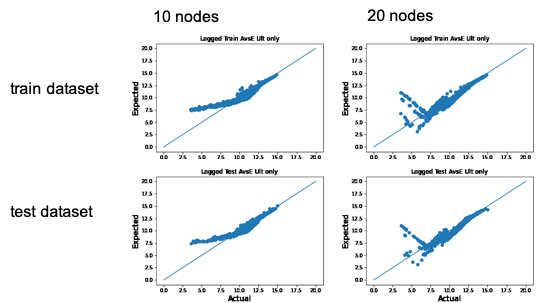

## Activation function

The model fits by adjusting the weights and biases that are applied to each node or neuron. An activation function is than applied to the output of each of the node after the weights and biases have been applied.  

 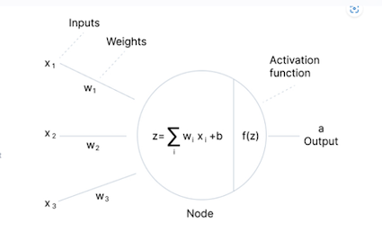 

This is essentially where the 'magic' happens within a neural network. Activation functions introduce non-linear properties to the network, allowing it to model complex data and learn intricate patterns. Without these non-linear activation functions, a neural network would just behave like a linear regression model, regardless of the number of layers.

We have used the ReLu function in our sample model. It is in fact a very simple function; it returns 0 for negative values and just itself for any input >0.

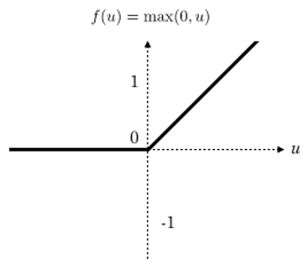

However the impact it has on the model compared to not using an activation function is significant.

The purple line is with using the ReLu activation function, the grey line is with no activation function.

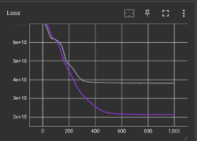

The difference can also be seen in the QQ plots.

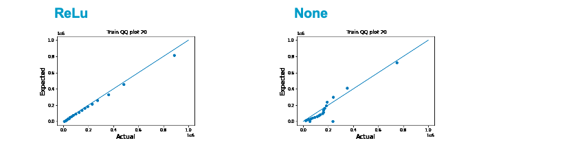

We tried out a number of different activation functions which are shown in the diagram below.

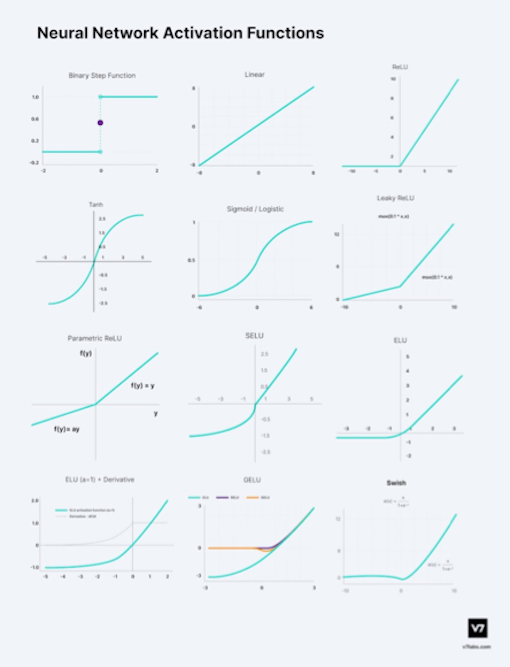  
The above diagram was taken from the following site which also provides a good explanation of each of the activation functions: [https://www.v7labs.com/blog/neural-networks-activation-functions](https://www.v7labs.com/blog/neural-networks-activation-functions)

To apply an activation function, you define which function you want to use at the point you define the layers. The example code below shows how you would apply the ReLu activation function in a scenario where you are using just one hidden layer. (It might also be helpful to refer to the layers and nodes section just above).

```{python}
#| eval: false

# 1 Layer
        self.hidden = torch.nn.Linear(n_input, n_hidden)   # First hidden layer
    
        h = F.relu(self.hidden(x))
        if self.batch_norm:
            h = self.batchn1(h)
        h = self.dropout(h)

        return torch.exp(self.linear(h))                                       
        
```

To change it to use, say the Leaky ReLu, it would become the following (and so on):

```{python}
#| eval: false

        h = F.leaky_relu(self.hidden(x))                                   
        
```

However for sigmoid you would use:

```{python}
#| eval: false

        h = torch.sigmoid(self.hidden(x))
        
```

or for no activation function it would become:

```{python}
#| eval: false

        h = F.leaky_relu(self.hidden(x))                                   
        
```

#### Findings

We did not find any activation functions that were conclusively better than ReLu for this model. Sigmoid and Tanh were significantly worse. 

NB: Sigmoid was even worse than without any activation function, probably as its output is limited to between 0 and 1, which can lead to gradients becoming very small, meaning that the updates to the weights become very small, making the training process slow and sometimes causing the network to stop learning altogether (the vanishing gradients problem).

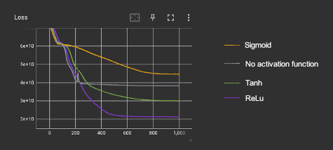  

Comparative graphs of AvsE:

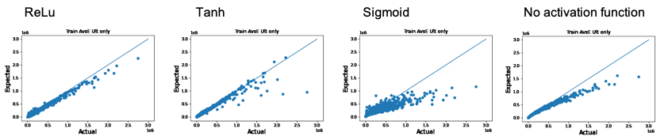  

When comparing  Leaky ReLu, SELU, ELU, and GELU, none seemed particularly better (nor significantly different) to ReLu for our sample model.

The graph on the left shows the loss graphs for each of ReLu, Leaky ReLu, SELU, ELU, and GELU (it also includes the results for no activation function - the orange line). The graph on the right is the same but for 6 different runs of the ReLu model - the differences do not seem to be any greater than is seen by random variation with the ReLu.

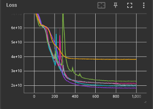  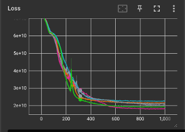  

## 4. Initialisation

We found that the starting point, or initialisation, of the expected values made a significant difference to the ability of the model to fit and to the results.

Setting the starting value to the mean of the ultimate claim values seemed to yield the optimum results.  

To change the starting value, you simply update the init_bias parameter which is set at the beginning of the [TabularNetRegressor class](https://institute-and-faculty-of-actuaries.github.io/mlr-blog/post/research/icnn-2024-01-explainer/#tabularnetregressor-anchor).

```{python}
#| eval: false

        init_bias=None,
        
```

If set to 'None' this defaults to the mean value, which is defined in the fit method of the TabularNetRegressor class as shown here:  

```{python}
#| eval: false

        self.init_bias_calc = np.log(y.mean()).values.astype(np.float32)
        
```

(To see just where in the code this is defined, scroll up one bullet point from the [partial fit method description](https://institute-and-faculty-of-actuaries.github.io/mlr-blog/post/research/icnn-2024-01-explainer/#partialfit-anchor) in the accompanying Explainer blog).  

To change to different starting values, you just set the init_bias parameter to the logged value you want to use, for example:

```{python}
#| eval: false

        init_bias=2.4,
        
```

The following graph shows how the loss value progressed as the model fitted.

On this measure it can be seen that the mean value (orange line) was best in that it produced the lowest loss value.


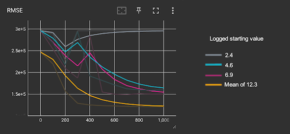 

NB: The model fits the natural log of the claim values. The mean claim size of the dataset is around 225,000 which equates to a logged value of 12.3.  

  
We can also see what happens during the fitting process.  

Here we show the logged AvsE graphs for points at all development periods as the model fits, at 100, 200 and 300 epochs respectively.  

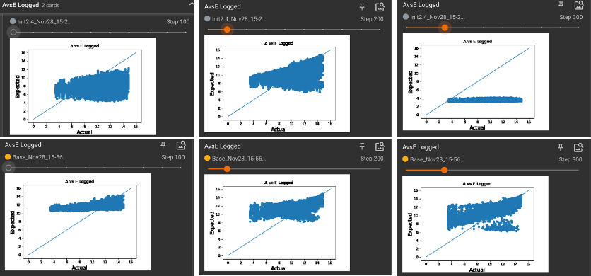

The first row shows what happens if we set a low logged starting value of 2.4. By 100 epochs the values have increased, but by 300 epochs it is possible to see that the model has not converged (which also matches the trajectory of the grey line on the loss graph above).

Conversely, the second row shows how the model fits when the mean claim size is used as the starting point. Here it can be seen that many of the points are starting to move more in line with the actual values as desired.

The following graphs show where the models end up using different starting values.  

The top row shows AvsE graphs for the ultimate (i.e. at development period 40 only) claim values, and the second row the QQ plots.

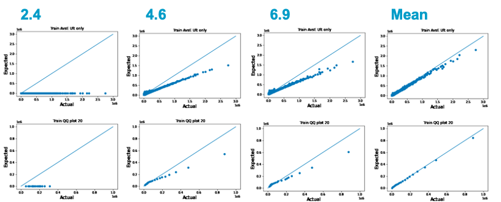

It is very clear from these graphs what a difference the starting value makes.  

Using a starting value greater than the mean did not improve the performance either.

## Loss function/Error term

The primary goal of training a machine learning model is to minimize the value of the loss function. In our sample model we have used the MSE for the loss function by applying by the [MSELoss](https://pytorch.org/docs/stable/generated/torch.nn.MSELoss.html) PyTorch criterion. 

We experimented with using a number of alternative error terms, or loss functions:  

* 1a. ((E-A)/A)^2  
* 1b. ((E-A)/E)^2  
* 2a. (A-E)^2/A  
* 2b. (A-E)^2/E  
* 3.(ln(E/A))^2  

The equivalent MSE equation would be (A-E)^2

None of the error terms we tried seemed to work better than the MSE. It was interesting to note how some seemed to improve the fit with smaller claims, and others with larger claims.  

NB: There are more ideas that could be explored further than those we have shown here, but this blog is just intended as an introduction.

See the [partial fit method section](https://institute-and-faculty-of-actuaries.github.io/mlr-blog/post/research/icnn-2024-01-explainer/#partialfit-anchor) in the accompanying Explainer blog for details of how and where the loss function is defined in the code.  
To change the MSELoss function to say, the error term 1a. ((E-A)/A)^2, you would change the line:

```{python}
#| eval: false

            loss = loss_fn(y_pred, y_tensor_batch) 
        
```

to:

```{python}
#| eval: false

            loss = torch.mean(torch.square((y_pred - y_tensor_batch)/y_tensor_batch))        
```

And similarly for the other error terms:

```{python}
#| eval: false

# Error 1b: ((E-A)/E)^2
            loss = torch.mean(torch.square((y_pred - y_tensor_batch)/y_pred))
    
# Error 2a: (A-E)^2/A
            loss = torch.mean(torch.square((y_pred - y_tensor_batch))/y_tensor_batch)
    
# Error 2.b: (A-E)^2/E
            loss = torch.mean(torch.square((y_pred - y_tensor_batch))/y_pred)
    
# Error 3: (ln(E/A))^2
            loss = torch.mean(torch.square(torch.log(y_pred / y_tensor_batch)))
            
```

#### Findings

After MSE, error term 3. (ln(E/A))^2 worked the best. Shown in purple on the below graph of RMSE against epoch. It seemed to work better than the MSE for smaller claims, but not so well for large claims.

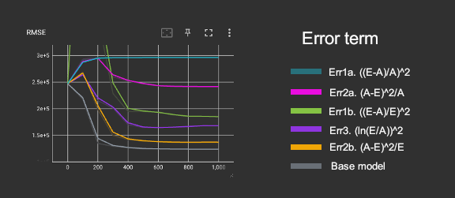 

The graphs below show how Err3. (top row) works better for small claims (AvsE graph of logged ultimates on the left) but not so well for large claims (graph of AvsE ultimates on the right), when compared to our base model which uses the PyTorch function MSELoss (bottom row).  
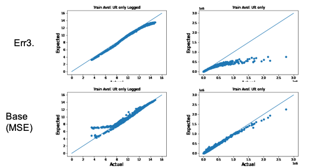 

Whilst the orange line, or error term 2b. (A-E)^2/E, looks like it performed well on the RMSE graph, when we look at the AvsE ultimate graphs (the logged version which better highlights the smaller claims is on the left) we can see that the lower RMSE value is probably due to the relatively good fit for large claims, but the expected small claims have not moved far from their starting logged value of 12.3.

 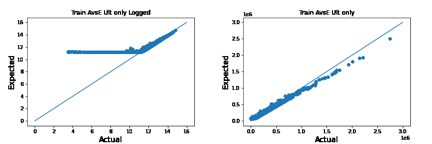 

**Errors 1a. and 2a.**  

With Err1a. ((E-A)/A)^2, it looks like the error term is converging to A/A with E converging to 0. In fact the RMSE value can be seen to increase as the model fits (blue line).  

A similar pattern, though less stark, can be seen with Err2a. (A-E)^2/A (pink line).  

The following graphs are the AvsE graphs with all records in the model plotted (i.e. there will be many points for each claim; one for each development period). The graph on the left shows the logged values and hence is better for seeing what is happening with smaller claims.

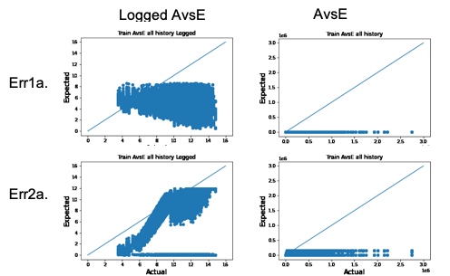 

**Errors 1b. and 2b.**

With both Err1b. ((E-A)/E)^2 and Err2b. (A-E)^2/E, a similar thing seems to be happening with the model not moving far from the starting values for smaller claims as it fits. 

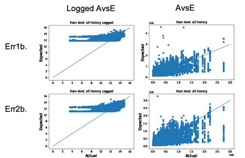 

## Batch norm

In a similar way that we pre-process the *input* variables to a neural network (i.e. we normalise them to zero mean and unit variance in order to enhance the performance and stability of the training process), batch norm normalises the *output* after the activation function is applied to each layer. This can improve the training process in terms of stability and speed.

A more detailed explanation can be found [here](https://towardsdatascience.com/batch-norm-explained-visually-how-it-works-and-why-neural-networks-need-it-b18919692739).

To apply batch norm you apply it for each hidden layer. Layers are defined in the section of code that [defines the neural network model](https://institute-and-faculty-of-actuaries.github.io/mlr-blog/post/research/icnn-2024-01-explainer/#step2). More detail on how layers are coded is provided in section 2. above.

The code below shows how the information needed for 1 layer is coded.

```{python}
#| eval: false

# Where there is 1 Layer:

        self.hidden = torch.nn.Linear(n_input, n_hidden)   # First hidden layer
        
        self.batch_norm = batch_norm
        if batch_norm:
            self.batchn1 = torch.nn.BatchNorm1d(n_hidden)  # Batchnorm layer
            
        self.dropout = nn.Dropout(dropout)                 # Dropout rate
    
        h = F.relu(self.hidden(x))
        if self.batch_norm:
            h = self.batchn1(h)
        h = self.dropout(h)

        return torch.exp(self.linear(h))     
            
```

If we look at the graph of loss function by epoch we can see an improvement using batch norm, in that it was quicker to get to the smaller loss function values. The blue line in the graph below is with batch norm and the grey line is without.

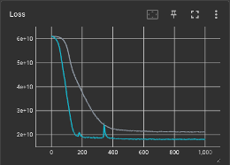 

However, when we looked at the other output measures such as AvsE, there did not seem to be a noticeable improvement with using batch norm. This is likely to be as the loss functions ended up at similar values. 

It may well be that batch norm proves more useful in other scenarios or with other models and datasets. For example we saw that the fit of the model using a sigmoid activation function was greatly improved by using batch norm.

## Graph descriptions

Detailed descriptions of the graphs used in this post can be found in our [Diagnostics blog](https://institute-and-faculty-of-actuaries.github.io/mlr-blog/post/research/icnn-2024-03-diagnostics/#section2).
