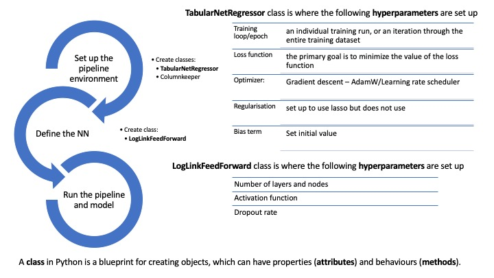

This is the first blog in our [Practical Introduction to Neural Networks Blog Series](https://institute-and-faculty-of-actuaries.github.io/mlr-blog/post/research/icnn-2024-02-covering/)

The aim of this blog is to help make Machine Learning accessible to more GI reserving actuaries. The more of us that are trying this out on data and learning, the quicker the research will advance. This blog is designed to be read in conjunction with an accompanying notebook that has been created to make it easier for you to take code for a neural network and readily apply it to your own GI reserving data.

The accompanying SampleNN.ipynb Jupyter notebook, which can be downloaded [here](./_SampleNN.ipynb), sets up and runs a simple neural network on individual claims data. This snapshot of code has been taken from a version of Jacky Poon’s blog: [From Chain Ladder to Individual Mixture Density Networks on SPLICE Data](https://institute-and-faculty-of-actuaries.github.io/mlr-blog/post/research/chain_ladder_to_individual_mdn/)

This document is aimed at someone who has a basic knowledge of how neural networks work in theory, but who wants to start applying them in practice in Python. Prior Python knowledge is not necessary (but some general coding knowledge might be helpful). 

Some prior theoretical knowledge about neural networks is assumed. A wealth of information on neural networks is readily available and we do not intend to regurgitate it here. For example, this [Coursera course](https://www.coursera.org/specializations/deep-learning) is one that some of us have done and found very useful. Our [Foundations page](https://institute-and-faculty-of-actuaries.github.io/mlr-blog/workstreams/foundations/) has more advice on how to get started with machine learning.

Some other introductory resources to neural networks that you may find useful:

* Our own blog which includes a section [A high level introduction to NNs](https://institute-and-faculty-of-actuaries.github.io/mlr-blog/post/literature-review/nn-cas2020/)
* [What are neural networks | IBM](https://www.ibm.com/topics/neural-networks)
* [Neural Networks (mlu-explain.github.io)](https://mlu-explain.github.io/neural-networks/)
* [Watching Neural Networks Learn - YouTube](https://www.youtube.com/watch?v=TkwXa7Cvfr8)

With thanks to ChatGPT for many of the code descriptions.

## How to use this document

This document is divided into the following sections. 
It is a reference document to be used alongside running the sample code we have provided, which can be downloaded [here](_SampleNN.ipynb).


[**1. The general Python environment**](#section1)
This gives some information on how to set up the Python environment for a Python novice (mainly by signposting to instructions from the excellent Actuaries’ Analytical Cookbook from the Actuaries Institute Australia).

[**2. The dataset**](#section2) A description of the dataset with links to the code used to produce it.

[**3. A step by step description of what the code does**](#section3)
This steps you through each stage of the code and explains what it is doing.

[**Glossary 1: Hyperparameters and definitions**](#glossary1)
Rather than putting detailed descriptions within section 3 and interrupting the flow, you can jump within the document to more detailed information on each of the hyperparameters as you wish. Equally, you can see a list of the the key hyperparameters and elements of the model here, and then trace back to where they are applied within the code. 

Our third blog in this series [Hyperparameters](https://institute-and-faculty-of-actuaries.github.io/mlr-blog/post/research/icnn-2024-04-hyperparameters/) looks at the impact of changing hyperparameters in more detail.

[**Glossary 2: List of parameters**](#glossary2)
A reference section to give a quick overview of all the input parameters and where they are set and used in the code.

[**Appendix**](#Appendix)  Explanations of some features that are included in the code but that are not actioned or used.

## The general Python environment {#section1} 
If you’ve not used Python before, the [Actuaries’ Analytical Cookbook](https://actuariesinstitute.github.io/cookbook/docs/index.html) (which is an initiative of the Young Data Analytics Working Group, a working group within the [Australian Actuaries Institute](https://actuaries.asn.au/))
is a great place to start. In particular see their [Setting up Your Python Environment](https://actuariesinstitute.github.io/cookbook/docs/getting_started.html) page. 

Our code uses various packages, such as PyTorch, scikit-learn, NumPy and Pandas - a number of which are introduced in the aforementioned [Cookbook](https://actuariesinstitute.github.io/cookbook/docs/Useful_Python_packages.html). PyTorch is a popular package for neural networks.

Instructions on how to install the packages can be found on the Cookbook's [Setting up Your Python Environment](https://actuariesinstitute.github.io/cookbook/docs/getting_started.html) page. 

The first part of the code shows you what versions of each package were installed when this code was run. Be warned, Python can be finicky; the code will be dependent on the particular version of the package(s) imported, what code worked for one version may not work on an earlier, or indeed even a subsequent, or later, version. This code was written using JupyterLab 3.2.1. 

The next line of code uses 'pip show' to show which version of a particular package is currently installed on your system. In our sample code notebook you can see what versions were used when our code was run (here we just shown an example for scikit-learn):

```{python}
#| eval: false

!pip show scikit-learn

```

The next section of code imports various libraries so they are available to be run with this code.  

* **pandas** - a Python library used for data manipulation and analysis.
* **numpy** (which stands for Numerical Python) - a fundamental package for scientific computing in Python. It is a library that provides support for large, multi-dimensional arrays and matrices, along with a large collection of high-level mathematical functions to operate on these arrays.
* **torch** (or PyTorch) - an open-source machine learning library developed by Facebook's AI Research lab. It is widely used for deep learning.
* **sklearn** (or scikit-learn) - an open-source machine learning library for the Python programming language. It's known for its simplicity, efficiency, and wide adoption in both academia and industry. 
* **math** - a library that provides access to mathematical functions.

```{python}
#| eval: false

import pandas as pd
import numpy as np
from matplotlib import pyplot as plt
import seaborn as sns

from torch.utils.data.sampler import BatchSampler, RandomSampler
from torch.utils.data import DataLoader

import torch
import torch.nn as nn
from torch.nn import functional as F

from torch.autograd import Variable

from sklearn.compose import ColumnTransformer, TransformedTargetRegressor
from sklearn.preprocessing import OneHotEncoder, StandardScaler, MinMaxScaler
from sklearn.pipeline import Pipeline

from sklearn.metrics import mean_squared_error

from sklearn.base import BaseEstimator, RegressorMixin, TransformerMixin
from sklearn.utils.validation import check_X_y, check_array, check_is_fitted

from sklearn.model_selection import GridSearchCV, RandomizedSearchCV, PredefinedSplit
import math

```

## The dataset {#section2} 

We are using SPLICE which produces simulated individual claims development data. For more information about SPLICE see our previous [blog](https://institute-and-faculty-of-actuaries.github.io/mlr-blog/post/data/splice/).

The dataset we are using has one record for every development period. It covers 40 development periods and 40 occurrence periods, and includes around 3,600 claims.

It is the most basic SPLICE dataset with no trends or particular features in it, ie it would produce a stable claims triangle.

The fields available within the dataset are:

Field name | Description
-----------|------------
claim_no | claim ID
pmt_no | Transaction ID for claim
occurrence_time | Time of accident
occurrence_period | Integer of occurrence_time, rounded up
claim_size | Ultimate settled claim size
notidel | Reporting delay from occurrence
setldel | Ultimate settled delay (measured from report/notification time)
payment_time | Time of payment
payment_period | Payment period, integer - rounded up
payment_size | Discrete payment size
payment_delay | Payment delay since notification or last transaction (ie discrete payment delay)

We have created a number of additional fields:

Field name | Description
-----------|------------
noti_period | Integer of notification time, rounded up. Calculated from occurence time and notidel
settle_period | Integer of settled time, rounded up. Calculated from occurence time, notidel and setldel
development_period | Integer of payment time, rounded up
payment_size_cumulative | Cumulative paid amount
log1_paid_cumulative | Natural logarithm of cumulative paid amount
paid_dev_factor | Development factor of cumulative paid
max_paid_dev_factor | Maximum development factor at that development period for that claim
min_paid_dev_factor | Minimum development factor at that development period for that claim

We have split the data into training and test datasets. Here we have split by claim, with 60% of claims in the training dataset and the remaining 40% in the test dataset. The full history of the claim is included in each dataset, so you can think of this as akin to 'rectangular data'.  

In traditional practice we would tend to include development up to a particular calendar period in the training data, and data after that calendar period in the test data; akin to the 'triangular data' we are used to in claims reserving.

We have used the rectangular data here as we are trying to understand what the models are doing, and we thought using this type of train/test split will give the most stable results. We have also tried out versions of the 'triangular' test/train split version too. We intend to publish examples of some of the investigations we have done like this one in the future. In the meantime we would encourage you to try it out for yourself. The train and test data splits can easily be modified to create a triangular split by using the *cutoff* parameter in the data preparation code we provide.

Here is a [sample notebook which takes the SPLICE data, puts it into the format we require to be used in the model, and creates the train and test datasets](_Dataprep.ipynb).

If you wanted to use your own data, you would need to get your data into the same format as this (ie one record for every development period) but you could add whatever explanatory variables to it that you liked.

## A step by step description of what the code does {#section3} 

[**Step 1: Sets up a ‘pipeline’**](#step1) A pipeline in the context of Machine Learning is a sequence of data processing and transformation steps combined with a final model (e.g. the NN) to create an end-to-end workflow. 

[**Step 2: Defines the neural network model**](#step2)

[**Step 3: Runs the pipeline and model**](#step3)


A graphic overview of the code structure (specific terms are explained in the subsequent text):

 
### Step 1: Setting up the pipeline {#step1}

Using a pipeline simplifies the process of preparing the data and applying a model to the data, and provides a structured framework for the process, making it more robust.

The primary benefits of using a pipeline include:

*	Convenience: It allows you to organize your preprocessing steps and model training in a clean and easy-to-understand way.
*	Reproducibility: It makes it easier to reproduce your experiments by encapsulating the entire workflow in a single object.
*	Preventing data leakage: By ensuring that preprocessing steps are applied separately to training and validation data during cross-validation or model evaluation, pipelines help prevent data leakage.


The code creates two custom-made classes; [**TabularNetRegressor**](#tabularnetregressor-anchor) and [**ColumnKeeper**](#columnkeeper-anchor). 

A **class** in Python is a blueprint for creating objects, which can have properties (**attributes**) and behaviours (**methods**). Classes provide a means of bundling data and functionality together. Creating a new class creates a new type of object, allowing new instances of that type to be made.

<a id="tabularnetregressor-anchor" style="text-decoration: none; color: inherit; font-weight: bold;"> TabularNetRegressor:</a> takes a default PyTorch ‘module’ which has a neural network architecture and prepares it for our specific use. For example, this class has various built-in hyperparameters and options including learning rate, batch normalisation, dropout, L1 regularisation and more.

* **torch.nn.Module** is the base class for all neural network modules in the PyTorch library which TabularNetRegressor inherits.

* TabularNetRegressor is designed to be used with scikit-learn, making it easy to integrate into a machine learning pipeline (in particular it inherits from scikit-learn's BaseEstimator and RegressorMixin classes).

* The main **methods** in the TabularNetRegressor class are; __ init __, fix_array, setup_module, fit, partial_fit, predict and score. These are all explained below. [Partial_fit](#partialfit-anchor) is the one you are most likely to interact with when tailoring the model, it is where the training loop and most of the hyperparameters are defined.

    +	__ **init** __: Initializes the object with the provided hyperparameters and options.<a id="inputparameters-anchor" style="text-decoration: none; color: inherit; font-weight: bold;"></a>
    
```{python}
#| eval: false

class TabularNetRegressor(BaseEstimator, RegressorMixin):
    
    def __init__(
        self, 
        module,
        criterion=nn.MSELoss(),
        max_iter=nn_iter,   
        max_lr=0.01,
        keep_best_model=False,
        batch_function=None,
        rebatch_every_iter=1,
        n_hidden=20,                  
        l1_penalty=0.0,          # lambda is a reserved word
        l1_applies_params=["linear.weight", "hidden.weight"],
        weight_decay=0.0,
        batch_norm=False,
        dropout=0.0,
        clip_value=None,
        verbose=1,                
        device="cpu", #if torch.backends.mps.is_available() else ("cuda" if torch.cuda.is_available() else "cpu"),  # Use GPU if available, leave mps off until more stable
        init_bias=None,
        **kwargs
    ):
        self.module = module
        self.criterion = criterion
        self.keep_best_model = keep_best_model
        self.l1_penalty = l1_penalty
        self.l1_applies_params = l1_applies_params
        self.weight_decay = weight_decay
        self.max_iter = max_iter
        self.n_hidden = n_hidden
        self.batch_norm = batch_norm
        self.batch_function = batch_function
        self.rebatch_every_iter = rebatch_every_iter
        self.dropout = dropout
        self.device = device
        self.target_device = torch.device(device)    
        self.max_lr = max_lr
        self.init_bias = init_bias
        self.print_loss_every_iter = max(1, int(max_iter / 10))
        self.verbose = verbose
        self.clip_value = clip_value
        self.kwargs = kwargs

```

*    + **fix_array:** A helper method to ensure the array format is consistent, converting a pandas DataFrame or Series to a NumPy array if necessary.

```{python}
#| eval: false

    def fix_array(self, y):
        "Need to be picky about array formats"
        if isinstance(y, pd.DataFrame) or isinstance(y, pd.Series):
            y = y.values
        if y.ndim == 1:
            y = y.reshape(-1, 1)
        y = y.astype(np.float32)
        return y
       

```

*    + **setup_module:** Sets up the PyTorch module (neural network architecture) using the provided input and output dimensions.

```{python}
#| eval: false

    def setup_module(self, n_input, n_output):
         
        # Training new model
        self.module_ = self.module(
            n_input=n_input, 
            n_output=n_output,
            n_hidden=self.n_hidden,
            batch_norm=self.batch_norm,
            dropout=self.dropout,
#           init_bias=self.init_bias_calc if self.init_bias is None else self.init_bias,
            **self.kwargs
        ).to(self.target_device)

```

*    +	<a id="fitmethod-anchor" style="text-decoration: none; color: inherit; font-weight: bold;">fit:</a> Trains the model using the provided input features (X) and target values (y) (and calls partial_fit)

```{python}
#| eval: false

    def fit(self, X, y):
        # The main fit logic is in partial_fit
        # We will try a few times if numbers explode because NNs are finicky and we are doing CV
        n_input = X.shape[-1]
        n_output = 1 if y.ndim == 1 else y.shape[-1]
        self.init_bias_calc = np.log(y.mean()).values.astype(np.float32)
        self.setup_module(n_input=n_input, n_output=n_output)

        # Partial fit means you take an existing model and keep training 
        # so the logic is basically the same
        self.partial_fit(X, y)

        return self

```

*    +	**partial_fit**: A method to perform partial fitting on the model, which can be useful for online learning or updating the model with new data. [say more, ie how can be used over and above fit….]  


The <a id="partialfit-anchor" style="text-decoration: none; color: inherit; font-weight: bold;">partial_fit method</a> performs the following functions (listed below as i to xii):  

*    i.	It first checks that the input features (X) and target values (y) have the correct shape using the check_X_y function from scikit-learn.
*    ii.	It then converts the input features (X) and target values (y) to PyTorch tensors, ensuring they have the correct data type and dimensions.
    
```{python}
#| eval: false

    def partial_fit(self, X, y):
        # Check that X and y have correct shape
        X, y = check_X_y(X, y, multi_output=True)

        # Convert to Pytorch Tensor
        X_tensor = torch.from_numpy(self.fix_array(X)).to(self.target_device)
        y_tensor = torch.from_numpy(self.fix_array(y)).to(self.target_device)

```

*    iii.	The [**optimizer**](#optimizer-anchor) is set up using the AdamW optimization algorithm with the specified learning rate and weight decay parameters. The optimizer's main purpose is to update the model's parameters (weights and biases) to minimize the loss function during the training process.

*    iv.	The [**learning rate scheduler**](#scheduler-anchor) is set up (using the OneCycleLR policy). A <a id="scheduler-anchor" style="text-decoration: none; color: inherit;"> learning rate scheduler</a> is used to adjust the learning rate during the training process, which can help the model converge faster and achieve better performance.

```{python}
#| eval: false

        # Optimizer - the generically useful AdamW. Other options like SGD
        # are also possible.
        optimizer = torch.optim.AdamW(
            params=self.module_.parameters(),
            lr=self.max_lr / 10,
            weight_decay=self.weight_decay
        )
        
        # Scheduler - one cycle LR
        scheduler = torch.optim.lr_scheduler.OneCycleLR(
            optimizer, 
            max_lr=self.max_lr, 
            steps_per_epoch=1, 
            epochs=self.max_iter
        )

```

*    v.	The [**loss function**](#lossfunction-anchor) is set up according to the criterion attribute of the TabularNetRegressor class. The primary goal of training a machine learning model is to minimize the value of the loss function. Here <a id="criterion-anchor" style="text-decoration: none; color: inherit;"> criterion</a> is set to MSELoss and so the model will find the best fit by minimising the MSE (mean square error).

*    vi.	The best loss is initially set to infinity, and a best model state is stored if the keep_best_model attribute is set to True.

```{python}
#| eval: false

        # Loss Function
        try:
            loss_fn = self.criterion(log_input=False).to(self.target_device)  # Pytorch loss function
        except TypeError:
            loss_fn = self.criterion  # Custom loss function

        best_loss = float('inf') # set to infinity initially

```

*    vii.	If a [**batch function**](#batchfunction-anchor) is provided, it's used to generate a batch of input features and target values.

```{python}
#| eval: false

        if self.batch_function is not None:
            X_tensor_batch, y_tensor_batch = self.batch_function(X_tensor, y_tensor)
        else:
            X_tensor_batch, y_tensor_batch = X_tensor, y_tensor

```

*    viii.	The main <a id="trainingloop-anchor" style="text-decoration: none; color: inherit; font-weight: bold"> training loop</a> iterates for the specified number of [epochs](#epoch-anchor) (ie <a id="maxiter-anchor" style="text-decoration: none; color: inherit; font-weight: bold"> max_iter</a>). For each epoch, the model is trained on the input features and target values, and the loss is calculated. If the L1 penalty is specified, it is added to the loss. The optimizer updates the model parameters, and the learning rate scheduler adjusts the learning rate according to the OneCycleLR policy.

*    ix.	If the keep_best_model attribute is set to True, the model state with the lowest loss is saved.

*    x. During training, the model's performance (RMSE and loss) is printed periodically, controlled by the print_loss_every_iter attribute.

*    xi.	If a custom batch function is provided and the rebatch_every_iter condition is met, the input features and target values are refreshed using the batch function.

*    xii.	If the keep_best_model attribute is set to True, the model's state is updated to the best model state found during training.

```{python}
#| eval: false

        # Training loop
        for epoch in range(self.max_iter):   # Repeat max_iter times

            self.module_.train()
            y_pred = self.module_(X_tensor_batch)  #  Apply current model

            loss = loss_fn(y_pred, y_tensor_batch) #  What is the loss on it?
            if self.l1_penalty > 0.0:        #  Lasso penalty
                loss += self.l1_penalty * sum(
                    [
                        w.abs().sum()
                        for p, w in self.module_.named_parameters()
                        if p in self.l1_applies_params
                    ]
                )

            if self.keep_best_model & (loss.item() < best_loss):
                best_loss = loss.item()
                self.best_model = self.module_.state_dict()

            optimizer.zero_grad()            #  Reset optimizer
            loss.backward()                  #  Apply back propagation

            # gradient norm clipping
            if self.clip_value is not None:
                grad_norm = torch.nn.utils.clip_grad_norm_(self.module_.parameters(), self.clip_value)
                # check if gradients have been clipped
                if (self.verbose >= 1) & (grad_norm > self.clip_value):
                    print(f'Gradient norms have been clipped in epoch {epoch}, value before clipping: {grad_norm}')    

            optimizer.step()                 #  Update model parameters
            scheduler.step()                 #  Update learning rate scheduler

            if torch.isnan(loss.data).tolist():
                raise ValueError('Error: nan loss')


            # Every self.print_loss_every_iter steps, print RMSE 
            if (epoch % self.print_loss_every_iter == 0) and (self.verbose > 0):
                self.module_.eval()                     # Eval mode 
                self.module_.point_estimates=True       # Distributional models - set to point                
                y_pred_point = self.module_(X_tensor)   # Get "real" model estimates
                assert(y_pred_point.size() == y_tensor.size())
                rmse = torch.sqrt(torch.mean(torch.square(y_pred_point - y_tensor)))
                self.module_.train()                     # back to training
                self.module_.point_estimates=False       # Distributional models - set to point
                
                print("Train RMSE: ", rmse.data.tolist(), " Train Loss: ", loss.data.tolist(), " Epoch: ", epoch)

            if (self.batch_function is not None) & (epoch % self.rebatch_every_iter == 0):
                print(f"refreshing batch on epoch {epoch}")
                X_tensor_batch, y_tensor_batch = self.batch_function(X_tensor, y_tensor)
                
            if self.keep_best_model:
                self.module_.load_state_dict(self.best_model)
                self.module_.eval()

        # Return the trained regressor
        return self

```

*	<a id="predict-anchor" style="text-decoration: none; color: inherit; font-weight: bold">predict:</a> Makes predictions using the trained model given input features (X).

```{python}
#| eval: false

        def predict(self, X, point_estimates=True):
        # Checks
        check_is_fitted(self)      # Check is fit had been called
        X = check_array(X)         # Check input

        # Convert to Pytorch Tensor
        X_tensor = torch.from_numpy(self.fix_array(X)).to(self.target_device)
      
        self.module_.eval()  # Eval (prediction) mode
        self.module_.point_estimates = point_estimates

        # Apply current model and convert back to numpy
        if point_estimates:
            y_pred = self.module_(X_tensor).cpu().detach().numpy()
            if y_pred.shape[-1] == 1: 
                return y_pred.ravel()
            else:
                return y_pred
        else:
            y_pred = self.module_(X_tensor)
            return y_pred

```

*	**score**: Calculates the negative root mean squared error (RMSE) score for the model, given input features (X) and true target values (y).

```{python}
#| eval: false

    def score(self, X, y):
        # Negative RMSE score (so a higher score means performance needs to be improved)
        y_pred = self.predict(X)
        y = self.fix_array(y)
        return -np.sqrt(np.mean((y_pred - y)**2))

```

<a id="columnkeeper-anchor" style="text-decoration: none; color: inherit; font-weight: bold;"> ColumnKeeper:</a> This class is a simple custom transformer that selects specific columns from a pandas DataFrame. It is useful in a preprocessing pipeline when you want to keep only certain columns for further processing. 

ColumnKeeper has three main methods:  

*	__ init __: Initializes the object with the list of columns to keep.  
*	fit: A no-operation method for compatibility with the scikit-learn API. It just returns the object itself.  
*	transform: Returns a copy of the input DataFrame with only the specified columns.

```{python}
#| eval: false

class ColumnKeeper(BaseEstimator, TransformerMixin):
    def __init__(self, cols):
        self.cols = cols

    def fit(self, X, y):
        return self

    def transform(self, X):
        return X.copy()[self.cols]

```

### Step 2: Defining the neural network model {#step2}
Here we use a basic Feed Forward neural network with a log link function. Applying a log link function means the model predicts the logarithm of the target variable, useful for such a skewed distribution as this where there are a lot of small claims, and far fewer very large claims. By exponentiating the predictions, we obtain the actual target values.

We create the <a id="NN-anchor" style="text-decoration: none; color: inherit; font-weight: bold">LogLinkForwardNet</a> class, a custom PyTorch neural network module. 

```{python}
#| eval: false

class LogLinkForwardNet(nn.Module):
    # Define the parameters in __init__
    def __init__(
        self, 
        n_hidden,                                          # hidden layer size
        batch_norm,                                        # whether to do batch norm (boolean) 
        dropout,                                           # dropout percentage,
        n_input=3,                                         # number of inputs
        n_output=1,                                        # number of outputs
        init_bias=0.0,                                     # init mean value to speed up convergence        
    ): 

        super(LogLinkForwardNet, self).__init__()

        self.hidden = torch.nn.Linear(n_input, n_hidden)   # Hidden layer
        self.batch_norm = batch_norm
        if batch_norm:
            self.batchn = torch.nn.BatchNorm1d(n_hidden)   # Batchnorm layer
        self.dropout = nn.Dropout(dropout)                 

        self.linear = torch.nn.Linear(n_hidden, n_output)  # Linear coefficients

        nn.init.zeros_(self.linear.weight)                 # Initialise to zero
        # nn.init.constant_(self.linear.bias, init_bias)        
        self.linear.bias.data = torch.tensor(init_bias)

    # The forward function defines how you get y from X.
    def forward(self, x):
        h = F.relu(self.hidden(x))                         # Apply hidden layer    
        if self.batch_norm:
            h = self.batchn(h)                       # Apply batchnorm   
       
        return torch.exp(self.linear(h))                   # log(Y) = XB -> Y = exp(XB)

```

The code above:

1.	Inherits the subclass torch.nn.Module.

2.	Defines the layers and operations in the __ init __ method of the LogLinkForwardNet class.  
    * __ init __: Initializes the neural network with the given parameters:
        +	n_hidden: The number of units in the hidden layer.
        +	batch_norm: A boolean value indicating whether to use batch normalisation in the hidden layer.
        + dropout: The dropout rate applied after the hidden layer.
        +	n_input: The number of input features.
        +	n_output: The number of output values (default is 1 for regression tasks).
        +	init_bias: The initial bias value for the output layer.

3.	The **forward** method defines the forward pass of the neural network, which calculates the output y given the input x:  
    *	Apply the hidden layer with the ReLU [activation function](#activationfunction-anchor).
    *	If batch_norm is True, apply batch normalisation to the hidden layer's output.
    *	Apply dropout after the hidden layer.
    *	Apply the linear (output) layer.
    *	Apply the exponential function to the output of the linear layer to ensure the predicted values are positive. This is done because we want to apply a log link function to the model.
    
### Step 3: Running the neural network using Pipeline {#step3} 

In scikit-learn, the **Pipeline class** is used to create the pipeline. Each step in the pipeline contains two elements: a string that gives the step a name, and an instance of a transformer or an estimator. Transformers are used for data preprocessing (e.g. scaling, encoding), while estimators are used for making predictions or fitting models (e.g. classifiers, regressors).

When you call the [fit method](#fitmethod-anchor) on a pipeline, it applies each transformation sequentially to the input data, passing the transformed output to the next step. The final estimator in the pipeline is then fit to the processed data. Similarly, when you call the [predict method](#predict-anchor), the pipeline applies the same sequence of transformations to the input data and uses the final estimator to make predictions.

Define which variables to include in the model:

```{python}
#| eval: false

list_of_features = [
    "claim_no",
    "occurrence_time", 
    "notidel", 
    "development_period", 
    "pmt_no",
    "log1_paid_cumulative",
    "max_paid_dev_factor",
    "min_paid_dev_factor",
]
output_field = ["claim_size"]
youtput="claim_size"

```

```{python}
#| eval: false

model_NN = Pipeline(
    steps=[
        ("keep", ColumnKeeper(list_of_features)),   
        ('zero_to_one', MinMaxScaler()),       # Important! Standardize deep learning inputs.
        ("model", TabularNetRegressor(LogLinkForwardNet))
    ]
)

model_NN.fit(
    dat.loc[dat.train_ind == 1],
    dat.loc[dat.train_ind == 1, ["claim_size"]]
)

```

The code above defines a pipeline named model_NN with three steps:  

1.	A [ColumnKeeper](#columnkeeper-anchor) step that keeps only the columns specified in the "list_of_features" variable. This is where which explanatory (or X) variables that are to be included in the model are defined.
2.	A MinMaxScaler step named "zero_to_one" that scales the features to a range between 0 and 1 - it standardises the data to improve model convergence and robustness.  
3.	A [TabularNetRegressor](#tabularnetregressor-anchor) step named "model" that uses the [LogLinkForwardNet](#NN-anchor) class as the neural network.  

The pipeline is then fit to the training data using the **fit method**. The training data is selected using the condition dat.train_ind == 1, and the target (or y) variable is the "claim_size" column.

## Glossary 1: Hyperparameters and definitions {#glossary1} 
A list of relevant hyperparameters, with a description of what they do, and where in the code they can be found.

For more details about many of the hyperparameters, and to see examples of the impact of changing them, see our separate [Hyperparameters blog](../icnn-2024-04-hyperparameters/). It takes you through practical demonstrations of what happens when you give hyperparameters different values, with the intention that you experiment yourself by running the code - we believe there is no substitute for 'doing' in order to learn how to use these models.

**Validation approach:** In this code there is no explicit validation approach implemented. The model is trained using the entire training dataset, and there is no separate validation set or cross-validation being performed.

<a id="epoch-anchor" style="text-decoration: none; color: inherit; font-weight: bold;"> Epoch:</a> an individual training run, or an iteration through the entire training dataset.
The max_iter and nn_iter parameters are used to set the number of epochs.
The training loop is defined in the [partial_fit method](#partialfit-anchor) of the TabularNetRegressor class.

<a id="lossfunction-anchor" style="text-decoration: none; color: inherit; font-weight: bold;"> Loss Function:</a> the primary goal of training a machine learning model is to minimize the value of the loss function. 
The criterion parameter defines which loss function to use. Here MSELoss is used. 
The loss function is defined in the [partial_fit method](#partialfit-anchor) of the TabularNetRegressor class.

<a id="optimizer-anchor" style="text-decoration: none; color: inherit; font-weight: bold;"> Optimizer:</a> updates the model's parameters (weights and biases) to minimize the loss function during the training process.

The AdamW optimizer is used here. It is an optimization algorithm that combines the ideas of the original Adam optimizer with weight decay regularisation.

The <a id="scheduler-anchor" style="text-decoration: none; color: inherit;"> scheduler</a> adjusts the learning rate during the training process according to the OneCycleLR policy.

* Input parameters are max_lr and weight_decay: 
    + max_lr is used to define the maximum learning rate for the One Cycle Learning Rate scheduler (torch.optim.lr_scheduler.OneCycleLR).
    + weight_decay is used in the AdamW optimizer (torch.optim.AdamW). It adds a penalty term to the loss function, which helps to prevent overfitting by penalizing large weights in the model.

The optimizer is defined in the [partial_fit](#partialfit-anchor) method of the TabularNetRegressor class.

More detailed information on AdamW, the scheduler and OncCycleLR are provided in our [Hyperparameters blog](https://institute-and-faculty-of-actuaries.github.io/mlr-blog/post/research/icnn-2024-04-hyperparameters/).

**Regularisation:** is a technique used in machine learning to prevent overfitting and encourage simpler models, by adding a penalty term to the loss function, specifically penalising large weights by adding the absolute values of the weights to the loss.  

Our code is set up to use Lasso, but it does not use it in practice as here L1_penalty is set to 0 at the start. 

Lasso regularisation is set up within the training loop of the [partial_fit method](#partialfit-anchor) of the TabularNetRegressor class.

<a id="layersandnodes-anchor" style="text-decoration: none; color: inherit; font-weight: bold;"> Hidden layers and nodes:</a> this LogLinkForwardNet model has one hidden layer and an output layer:  

*	An input layer with a number of nodes equal to n_input, which is the number of input features.
This is not an explicit layer in the code, it determines the input size of the neural network.
*	A fully connected (dense) hidden layer with n_hidden nodes. 
This layer is defined by the line self.hidden = torch.nn.Linear(n_input, n_hidden).
*	A fully connected (dense) output layer with n_output nodes. 
This layer is defined by the line self.linear = torch.nn.Linear(n_hidden, n_output).

The layers are defined in the [LogLinkForwardNet](#NN-anchor) class.

<a id="weightsandbiases-anchor" style="text-decoration: none; color: inherit; font-weight: bold;"> Weights and biases:</a> are modified by the [optimizer](#optimizer-anchor).  

In this code, self.hidden and self.linear are instances of the torch.nn.Linear class, which have weights and biases as their internal parameters. You can access the weights and biases of these layers by calling:

* For the hidden layer:
    + Weights: self.hidden.weight
    + Bias: self.hidden.bias
* For the linear layer:
    + Weights: self.linear.weight
    + Bias: self.linear.bias  

The bias term for the output layer (self.linear) is initialized using the init_bias parameter.
The layers, and so the weights and biases, are defined in the [LogLinkForwardNet](#NN-anchor) class.

<a id="droputrate-anchor" style="text-decoration: none; color: inherit; font-weight: bold;"> Dropout rate:</a> dropout is a regularisation technique used in neural networks to prevent overfitting.  

Dropout works by randomly "dropping out" (i.e. setting to zero) a proportion of the nodes in a layer during training. It is typically set between 0 and 1. For example, a dropout rate of 0.5 means that approximately 50% of the nodes in a layer are dropped out during each training iteration.  

The dropout parameter is set at the start.
The dropout rate is defined in the [LogLinkForwardNet](#NN-anchor) class.

<a id="activationfunction-anchor" style="text-decoration: none; color: inherit; font-weight: bold;"> Activation function:</a> the activation function here is defined as ReLU in the [LogLinkForwardNet](#NN-anchor) class. More information about activation functions can be found in our Hyperparameters blog (to be published soon).

## Glossary 2: Input parameters {#glossary2} 

Most of the input parameters are set at the beginning of the TabularNetRegressor class definition, under __ [init](#inputparameters) __. The links provided in the Description column of the table below take you to where they are used in the code (as opposed to where their values are set).

Input parameter | Value | Description
----------------|-------|------------
nn_iter         |1000    | the number of epochs to run. Set right at the beginning of the code notebook
max_iter        |nn_iter    | the maximum number of [epochs](#trainingloop-anchor) before training stops. Set to nn_iter here
criterion       |nn.MSELoss()| sets which [loss function](#lossfunction-anchor) to use
max_lr |0.01 | maximum learning rate – used within the [optimizer](#partialfit-anchor) and scheduler    
weight_decay |0.0 | weight decay - used in the [optimizer](#partialfit-anchor)  
init_bias |None |initial bias term - if set to ‘none’ it is set to be the log of the mean of the y variables  

The **X and y variables** to be used are defined when the neural network is [run](#step3).
The explanatory or X variables are defined in the *list_of_features* variable, which is used in the Columnkeeper step when you define the model_NN pipeline.

```{python}
#| eval: false

list_of_features = [
    "claim_no",
    "occurrence_time", 
    "notidel", 
    "development_period", 
    "pmt_no",
    "log1_paid_cumulative",
    "max_paid_dev_factor",
    "min_paid_dev_factor",
]

        ("keep", ColumnKeeper([list_of_features)),   # both

```

The y variable is defined when the pipeline is fit to the training data, here as *claim_size*.

```{python}
#| eval: false

model_NN.fit(
    dat.loc[dat.train_ind == 1],
    dat.loc[dat.train_ind == 1, ["claim_size"]]
)

```

The **number of nodes and layers** are set when the neural network is defined in the [LogLinkForwardNet](#NN-anchor) class. This code only fits one layer. Our [Hyperparameters blog](https://institute-and-faculty-of-actuaries.github.io/mlr-blog/post/research/icnn-2024-04-hyperparameters/) looks at how to add additional hidden layers.

Input parameter | Value | Description
----------------|-------|------------
n_hidden        |20     | number of nodes in the hidden layer 	
n_input         |X.shape[-1] | input layer size – set to be the same as the number of input features (or explanatory, or x variables)
n_output        | = 1 if y.ndim == 1 else y.shape[-1]|	output layer size – set to be the same as the number of target values (or y variables)
l1_penalty      |0.0 | Lasso penalty     l1_applies_params=["linear.weight", "hidden.weight"]
dropout         |0.0  | dropout rate

The following parameters relate to batch normalisation and gradient clipping but are not actioned in our runs and we do not go into them here. A description of what these features are is provided in the [Appendix](#appendix).  

* batch_norm
* batch_function       
* rebatch_every_iter
* clip_value

Other input parameters that can be changed (these can all be found in the [partial_fit method](#partialfit-anchor)):  

* verbose - 0 means don't print. 1 means do print (used to indicate whether to print out the RMSE value during training)
* device - Use GPU if available, leave mps off until more stable [needs more description]
* **kwargs - kwargs is short for "keyword arguments" and is a convention used in Python functions or method signatures to indicate that the function can accept a variable number of keyword arguments. 

## Appendix {#appendix} 

These features are not actioned in our runs, and we do not focus on them in this document, but as they are built into the code we provide some explanation here.

**Batch normalisation**  
Batch normalisation (BatchNorm) is a technique used to improve the training of deep neural networks. It helps address the issue of internal covariate shift, which occurs when the distribution of inputs to a given layer changes during training. This can slow down training and make it difficult for the network to converge.  

The main idea behind batch normalisation is to normalise the activations of each layer to have zero mean and unit variance. This is done by calculating the mean and variance of the activations for each mini-batch and then normalising the activations using these statistics. The normalised activations are then scaled and shifted by learnable parameters (gamma and beta), allowing the model to learn the optimal scale and shift for each layer.  

Batch normalisation has several benefits:

1.	It allows the use of higher learning rates, as it helps mitigate the risk of exploding or vanishing gradients.
2.	It reduces the sensitivity to weight initialization, making it easier to train deep networks.
3.	It provides some regularisation effect, reducing the need for other regularisation techniques like dropout.
4.	It can speed up the convergence of the training process.

In PyTorch, batch normalisation can be applied using the torch.nn.BatchNorm1d class for 1-dimensional inputs or the torch.nn.BatchNorm2d class for 2-dimensional inputs (like images).

<a id="batchfunction-anchor" style="text-decoration: none; color: inherit; font-weight: bold;"> Batch Function</a>  
In the context of the TabularNetRegressor class, batch function is an optional function provided by the user that modifies the training data in some way before it is passed to the neural network during training.

The batch_function should take the input tensor X_tensor and the target tensor y_tensor as arguments and return a new pair of tensors (X_tensor_batch, y_tensor_batch). These modified tensors are then used for training the model.
For example, a user might define a custom batch_function to implement a specific data augmentation technique or to create mini-batches by randomly sampling from the input data. Here's a simple example of a batch_function that selects a random subset of data:  

```{python}
#| eval: false

def random_batch(X_tensor, y_tensor, batch_size=32): 
    indices = torch.randperm(len(X_tensor))[:batch_size] 
    X_tensor_batch = X_tensor[indices] 
    y_tensor_batch = y_tensor[indices] 
    return X_tensor_batch, y_tensor_batch 

```

In the TabularNetRegressor class, if the batch_function is provided, it is called during the training loop to generate new input and target tensors for each iteration. If batch_function is not provided or set to None, the entire input and target tensors are used for training.

**Gradient norm clipping**  
Gradient norm clipping is a technique used during the training of neural networks to prevent the exploding gradient problem. Exploding gradients occur when the gradients of the loss function with respect to the model's parameters become very large, causing the model's weights to update by a large amount. This can result in an unstable training process, where the model's loss oscillates or diverges instead of converging.

Gradient norm clipping works by limiting the norm (magnitude) of the gradient vector. If the computed gradient norm exceeds a predefined threshold, the gradients are scaled down proportionally to keep the norm below or equal to the threshold. This prevents the gradients from becoming too large and ensures more stable training.

In PyTorch, gradient norm clipping can be applied using the torch.nn.utils.clip_grad_norm_ function. Here's an example of how to apply gradient norm clipping in a training loop:

```{python}
#| eval: false

import torch.optim as optim # ... define your model, loss function, and optimizer ... 
clip_value = 5.0 # the threshold for gradient norm clipping 

for epoch in range(num_epochs): 
    optimizer.zero_grad() 
    outputs = model(inputs) 
    loss = loss_function(outputs, targets) 
    
    loss.backward() 

# Apply gradient norm clipping 
torch.nn.utils.clip_grad_norm_(model.parameters(), clip_value) optimizer.step() 

```

In this example, the gradients are clipped if their norm exceeds 5.0. The choice of the threshold depends on the specific problem and model architecture and can be treated as a hyperparameter that may require tuning.

## Relevant Links

[Practical Introduction to Neural Networks Blog Series](https://institute-and-faculty-of-actuaries.github.io/mlr-blog/post/research/icnn-2024-02-covering/)

Download the sample code here:
* [SampleNN.ipynb](_SampleNN.ipynb)
* [Dataprep.ipynb](_Dataprep.ipynb)
